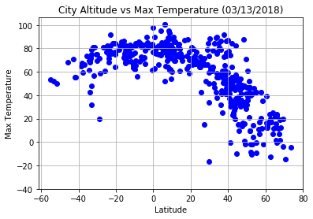
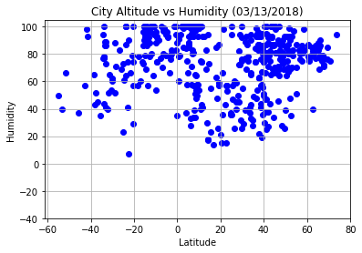
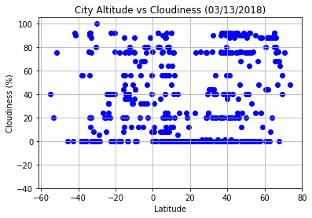
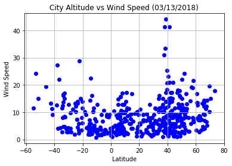

```python
from citipy import citipy
from random import uniform
import pandas as pd
import numpy as np
import csv
import random
import matplotlib.pyplot as plt
import requests
import json
from datetime import datetime as dt

from config import maps_key, place_key, api_key
```

Overall, the maximum temperture increases as the latitude gets closer to 0. The temperature decreases as the latitude gets further from 0. Since 0 is where the equator is, this suggests that temperature is hotter by the equator!


There are not many trends shown in the other graphs. It does not seem like there is much of a correlation between humidity and latitude. 

Longitude vs. Temperature has a similar trend to latitude vs. temperature. In both cases, the temperature decreases as long/lat gets further from 0. 


```python
##generate random lat, long

city = {}
cities = []
#country = []
def newpoint():
    return uniform(-180,180), uniform(-90, 90)

while len(cities) < 850:
    points = []
    points = list((newpoint() for x in range(850)))
    for i in range(len(points)):
        lat = points[i][0]
        long = points[i][1]
        city[citipy.nearest_city(lat,long).city_name] = points[i]
#        country.append(citipy.nearest_city(lat,long).country_code)
    cities = list(set(city))
    
```


```python
## the generated lat and long are not exactly where the city is. 
```


```python
a = list(city.keys())

city_df = pd.DataFrame([city for city in a], columns=["City"])

```


```python

##This code uses the randomly generated lat and long and puts it in the dataframe
##however, the lat and long are not totally accurate

# for index, row in city_df.iterrows():
#     lat = city[a[index]][0]
#     long = city[a[index]][1]
#    # country1 = country[index]
#     city_df.set_value(index, "Lat", lat)
#     city_df.set_value(index, "Long", long)
# #    city_df.set_value(index, "Country", country1)
```


```python
##When doinng the following for-loop, some of the cities are not recognized, which is why 850 are generated, then 500 are sampled
```


```python

city_df["Country"] = ""
city_df["Lat"] = ""
city_df["Long"] = ""
for index, row in city_df.iterrows():
    target_city = city_df["City"][index]
    target_url = "https://maps.googleapis.com/maps/api/geocode/json?" \
    "address=%s&key=%s" % (target_city, maps_key)
    geo_data = requests.get(target_url).json()
    try:
        lat = geo_data["results"][0]["geometry"]["location"]["lat"]
        lng = geo_data["results"][0]["geometry"]["location"]["lng"]
    except IndexError:
        lat = np.NaN
        lng = np.NaN
    
    try:
        country = geo_data["results"][0]["address_components"][3]["long_name"]
    except IndexError:
        country = "some weird country"
        continue
    #print("settings values " +city_df["City"][index])
    city_df.set_value(index, "Country", country)
    city_df.set_value(index, "Lat", lat)
    city_df.set_value(index, "Long", lng)
```


```python
#geo_data
city_df["Lat"].replace("",np.NaN, inplace =True)
```


```python


##Get rid of the ones that cannot find a country or lat long
city_df1 = city_df1.dropna(axis = 0,how = "any",inplace = False)
# city_df["Country"].dtype
len(city_df1)


```


    669


```python
city_df1
```


<div>
<style>
    .dataframe thead tr:only-child th {
        text-align: right;
    }

    .dataframe thead th {
        text-align: left;
    }

    .dataframe tbody tr th {
        vertical-align: top;
    }
</style>
<table border="1" class="dataframe">
  <thead>
    <tr style="text-align: right;">
      <th></th>
      <th>City</th>
      <th>Country</th>
      <th>Lat</th>
      <th>Long</th>
    </tr>
  </thead>
  <tbody>
    <tr>
      <th>0</th>
      <td>bargal</td>
      <td>Somalia</td>
      <td>11.285478</td>
      <td>51.0763</td>
    </tr>
    <tr>
      <th>2</th>
      <td>port alfred</td>
      <td>South Africa</td>
      <td>-33.586407</td>
      <td>26.8851</td>
    </tr>
    <tr>
      <th>4</th>
      <td>victoria</td>
      <td>United States</td>
      <td>28.805267</td>
      <td>-97.0036</td>
    </tr>
    <tr>
      <th>5</th>
      <td>ejura</td>
      <td>Ghana</td>
      <td>7.384720</td>
      <td>-1.35898</td>
    </tr>
    <tr>
      <th>7</th>
      <td>belushya guba</td>
      <td>Russia</td>
      <td>71.545556</td>
      <td>52.3203</td>
    </tr>
    <tr>
      <th>8</th>
      <td>ushuaia</td>
      <td>Argentina</td>
      <td>-54.801912</td>
      <td>-68.303</td>
    </tr>
    <tr>
      <th>11</th>
      <td>tsihombe</td>
      <td>Madagascar</td>
      <td>-25.316847</td>
      <td>45.4863</td>
    </tr>
    <tr>
      <th>12</th>
      <td>east london</td>
      <td>South Africa</td>
      <td>-33.029158</td>
      <td>27.8546</td>
    </tr>
    <tr>
      <th>17</th>
      <td>amderma</td>
      <td>Russia</td>
      <td>69.751221</td>
      <td>61.6637</td>
    </tr>
    <tr>
      <th>19</th>
      <td>george</td>
      <td>South Africa</td>
      <td>-33.988128</td>
      <td>22.453</td>
    </tr>
    <tr>
      <th>20</th>
      <td>bredasdorp</td>
      <td>Western Cape</td>
      <td>-34.538522</td>
      <td>20.0569</td>
    </tr>
    <tr>
      <th>21</th>
      <td>albany</td>
      <td>United States</td>
      <td>42.652579</td>
      <td>-73.7562</td>
    </tr>
    <tr>
      <th>22</th>
      <td>souillac</td>
      <td>France</td>
      <td>44.893626</td>
      <td>1.47861</td>
    </tr>
    <tr>
      <th>23</th>
      <td>busselton</td>
      <td>Australia</td>
      <td>-33.655493</td>
      <td>115.35</td>
    </tr>
    <tr>
      <th>26</th>
      <td>umzimvubu</td>
      <td>South Africa</td>
      <td>-30.778175</td>
      <td>28.9529</td>
    </tr>
    <tr>
      <th>27</th>
      <td>aliwal north</td>
      <td>South Africa</td>
      <td>-30.698394</td>
      <td>26.7202</td>
    </tr>
    <tr>
      <th>28</th>
      <td>nanyamba</td>
      <td>Tanzania</td>
      <td>-10.687780</td>
      <td>39.7987</td>
    </tr>
    <tr>
      <th>29</th>
      <td>hermanus</td>
      <td>South Africa</td>
      <td>-34.409200</td>
      <td>19.2504</td>
    </tr>
    <tr>
      <th>30</th>
      <td>hithadhoo</td>
      <td>Maldives</td>
      <td>-0.606057</td>
      <td>73.0892</td>
    </tr>
    <tr>
      <th>31</th>
      <td>dikson</td>
      <td>Russia</td>
      <td>73.504890</td>
      <td>80.5809</td>
    </tr>
    <tr>
      <th>32</th>
      <td>georgetown</td>
      <td>Washington</td>
      <td>38.907609</td>
      <td>-77.0723</td>
    </tr>
    <tr>
      <th>33</th>
      <td>pauini</td>
      <td>69860-000</td>
      <td>-7.729195</td>
      <td>-68.3339</td>
    </tr>
    <tr>
      <th>34</th>
      <td>kruisfontein</td>
      <td>Eastern Cape</td>
      <td>-33.984336</td>
      <td>24.7321</td>
    </tr>
    <tr>
      <th>35</th>
      <td>redwater</td>
      <td>United States</td>
      <td>33.358180</td>
      <td>-94.2544</td>
    </tr>
    <tr>
      <th>36</th>
      <td>port elizabeth</td>
      <td>South Africa</td>
      <td>-33.713925</td>
      <td>25.5207</td>
    </tr>
    <tr>
      <th>37</th>
      <td>penzance</td>
      <td>United Kingdom</td>
      <td>50.118798</td>
      <td>-5.53759</td>
    </tr>
    <tr>
      <th>38</th>
      <td>dubrovytsya</td>
      <td>Ukraine</td>
      <td>51.576473</td>
      <td>26.5706</td>
    </tr>
    <tr>
      <th>39</th>
      <td>attawapiskat</td>
      <td>Ontario</td>
      <td>52.925885</td>
      <td>-82.4289</td>
    </tr>
    <tr>
      <th>40</th>
      <td>mapiri</td>
      <td>Bolivia</td>
      <td>-15.307583</td>
      <td>-68.2206</td>
    </tr>
    <tr>
      <th>41</th>
      <td>somerset</td>
      <td>United States</td>
      <td>41.769543</td>
      <td>-71.1286</td>
    </tr>
    <tr>
      <th>...</th>
      <td>...</td>
      <td>...</td>
      <td>...</td>
      <td>...</td>
    </tr>
    <tr>
      <th>869</th>
      <td>dembi dolo</td>
      <td>Ethiopia</td>
      <td>8.533310</td>
      <td>34.8017</td>
    </tr>
    <tr>
      <th>872</th>
      <td>escanaba</td>
      <td>United States</td>
      <td>45.745247</td>
      <td>-87.0646</td>
    </tr>
    <tr>
      <th>873</th>
      <td>kamenka</td>
      <td>Russia</td>
      <td>53.186259</td>
      <td>44.0123</td>
    </tr>
    <tr>
      <th>874</th>
      <td>grimari</td>
      <td>Central African Republic</td>
      <td>5.739893</td>
      <td>20.0539</td>
    </tr>
    <tr>
      <th>875</th>
      <td>oriximina</td>
      <td>Brazil</td>
      <td>-1.761831</td>
      <td>-55.8638</td>
    </tr>
    <tr>
      <th>876</th>
      <td>tahta</td>
      <td>Sohag Governorate</td>
      <td>26.764796</td>
      <td>31.4983</td>
    </tr>
    <tr>
      <th>877</th>
      <td>turtkul</td>
      <td>Uzbekistan</td>
      <td>41.551874</td>
      <td>60.9907</td>
    </tr>
    <tr>
      <th>878</th>
      <td>reconquista</td>
      <td>Argentina</td>
      <td>-29.144819</td>
      <td>-59.6435</td>
    </tr>
    <tr>
      <th>879</th>
      <td>erie</td>
      <td>United States</td>
      <td>42.129224</td>
      <td>-80.0851</td>
    </tr>
    <tr>
      <th>880</th>
      <td>marawi</td>
      <td>Philippines</td>
      <td>8.010621</td>
      <td>124.298</td>
    </tr>
    <tr>
      <th>881</th>
      <td>seminole</td>
      <td>United States</td>
      <td>27.839747</td>
      <td>-82.7912</td>
    </tr>
    <tr>
      <th>882</th>
      <td>mutoko</td>
      <td>Zimbabwe</td>
      <td>-17.408632</td>
      <td>32.2257</td>
    </tr>
    <tr>
      <th>883</th>
      <td>toliary</td>
      <td>Madagascar</td>
      <td>-23.351619</td>
      <td>43.6855</td>
    </tr>
    <tr>
      <th>884</th>
      <td>sim</td>
      <td>Mesa</td>
      <td>33.309951</td>
      <td>-111.672</td>
    </tr>
    <tr>
      <th>885</th>
      <td>bathurst</td>
      <td>Australia</td>
      <td>-33.419282</td>
      <td>149.578</td>
    </tr>
    <tr>
      <th>887</th>
      <td>odweyne</td>
      <td>Somalia</td>
      <td>9.410198</td>
      <td>45.063</td>
    </tr>
    <tr>
      <th>888</th>
      <td>campana</td>
      <td>Geneva Township</td>
      <td>41.865334</td>
      <td>-88.316</td>
    </tr>
    <tr>
      <th>889</th>
      <td>charlestown</td>
      <td>Massachusetts</td>
      <td>42.378206</td>
      <td>-71.0602</td>
    </tr>
    <tr>
      <th>890</th>
      <td>bela</td>
      <td>India</td>
      <td>25.920430</td>
      <td>81.9917</td>
    </tr>
    <tr>
      <th>892</th>
      <td>mitsamiouli</td>
      <td>Comoros</td>
      <td>-11.387170</td>
      <td>43.2981</td>
    </tr>
    <tr>
      <th>893</th>
      <td>tavda</td>
      <td>Russia</td>
      <td>58.044289</td>
      <td>65.2561</td>
    </tr>
    <tr>
      <th>895</th>
      <td>wawa</td>
      <td>Washington</td>
      <td>38.904417</td>
      <td>-77.0432</td>
    </tr>
    <tr>
      <th>896</th>
      <td>moba</td>
      <td>Democratic Republic of the Congo</td>
      <td>-7.036848</td>
      <td>29.7629</td>
    </tr>
    <tr>
      <th>897</th>
      <td>maceio</td>
      <td>State of Alagoas</td>
      <td>-9.649849</td>
      <td>-35.7089</td>
    </tr>
    <tr>
      <th>898</th>
      <td>jodhpur</td>
      <td>India</td>
      <td>26.238947</td>
      <td>73.0243</td>
    </tr>
    <tr>
      <th>899</th>
      <td>kodino</td>
      <td>Russia</td>
      <td>63.717388</td>
      <td>39.6677</td>
    </tr>
    <tr>
      <th>901</th>
      <td>monatele</td>
      <td>Cameroon</td>
      <td>4.275392</td>
      <td>11.2665</td>
    </tr>
    <tr>
      <th>902</th>
      <td>krasnaya gorbatka</td>
      <td>Russia</td>
      <td>55.869172</td>
      <td>41.7573</td>
    </tr>
    <tr>
      <th>903</th>
      <td>itacarambi</td>
      <td>39470-000</td>
      <td>-15.073815</td>
      <td>-44.134</td>
    </tr>
    <tr>
      <th>905</th>
      <td>elat</td>
      <td>Israel</td>
      <td>29.557669</td>
      <td>34.9519</td>
    </tr>
  </tbody>
</table>
<p>669 rows × 4 columns</p>
</div>


```python

city_df_sample = city_df1
city_df1["Temp"] = ""
city_df1["Humidity"] = ""
city_df1["Date"] = ""
city_df1["Wind Speed"] = ""
city_df1["Cloudiness"] = ""


```


```python
##Using the weather api

url = "http://api.openweathermap.org/data/2.5/weather?"
units = "Imperial"


```


```python
##Sometimes the weather api does not recognize some of the cities, in that case, a NaN is put in that place
count = 0
for index, row in city_df1.iterrows():
    target_url = "http://api.openweathermap.org/data/2.5/weather?units=%s&APPID=%s&q=%s" % (units,api_key, row['City'])
    cities_weather = requests.get(target_url).json()
    try:
        city_df1.set_value(index, "Temp", cities_weather["main"]["temp_max"])
        city_df1.set_value(index, "Humidity", cities_weather["main"]["humidity"])
        city_df1.set_value(index, "Date", cities_weather["dt"])
        city_df1.set_value(index, "Wind Speed", cities_weather["wind"]["speed"])
        city_df1.set_value(index, "Cloudiness", cities_weather["clouds"]["all"])
    except KeyError:
        city_df1.set_value(index, "Temp", np.NaN)
        city_df1.set_value(index, "Humidity", np.NaN)
        city_df1.set_value(index, "Date",np.NaN)
        city_df1.set_value(index, "Wind Speed", np.NaN)
        city_df1.set_value(index, "Cloudiness", np.NaN)
        continue
        
    count = count + 1
       
    print("------------------------")
    print("Processing Information: " , count, 'With City: ' , cities_weather["name"])
    print(target_url)
```

    ------------------------
    Processing Information:  1 With City:  Port Alfred
    http://api.openweathermap.org/data/2.5/weather?units=Imperial&APPID=796fc7786f1ced770caae62b2b4d5d7b&q=port alfred
    ------------------------
    Processing Information:  2 With City:  Victoria
    http://api.openweathermap.org/data/2.5/weather?units=Imperial&APPID=796fc7786f1ced770caae62b2b4d5d7b&q=victoria
    ------------------------
    Processing Information:  3 With City:  Ejura
    http://api.openweathermap.org/data/2.5/weather?units=Imperial&APPID=796fc7786f1ced770caae62b2b4d5d7b&q=ejura
    ------------------------
    Processing Information:  4 With City:  Ushuaia
    http://api.openweathermap.org/data/2.5/weather?units=Imperial&APPID=796fc7786f1ced770caae62b2b4d5d7b&q=ushuaia
    ------------------------
    Processing Information:  5 With City:  East London
    http://api.openweathermap.org/data/2.5/weather?units=Imperial&APPID=796fc7786f1ced770caae62b2b4d5d7b&q=east london
    ------------------------
    Processing Information:  6 With City:  George
    http://api.openweathermap.org/data/2.5/weather?units=Imperial&APPID=796fc7786f1ced770caae62b2b4d5d7b&q=george
    ------------------------
    Processing Information:  7 With City:  Bredasdorp
    http://api.openweathermap.org/data/2.5/weather?units=Imperial&APPID=796fc7786f1ced770caae62b2b4d5d7b&q=bredasdorp
    ------------------------
    Processing Information:  8 With City:  Albany
    http://api.openweathermap.org/data/2.5/weather?units=Imperial&APPID=796fc7786f1ced770caae62b2b4d5d7b&q=albany
    ------------------------
    Processing Information:  9 With City:  Souillac
    http://api.openweathermap.org/data/2.5/weather?units=Imperial&APPID=796fc7786f1ced770caae62b2b4d5d7b&q=souillac
    ------------------------
    Processing Information:  10 With City:  Busselton
    http://api.openweathermap.org/data/2.5/weather?units=Imperial&APPID=796fc7786f1ced770caae62b2b4d5d7b&q=busselton
    ------------------------
    Processing Information:  11 With City:  Aliwal North
    http://api.openweathermap.org/data/2.5/weather?units=Imperial&APPID=796fc7786f1ced770caae62b2b4d5d7b&q=aliwal north
    ------------------------
    Processing Information:  12 With City:  Nanyamba
    http://api.openweathermap.org/data/2.5/weather?units=Imperial&APPID=796fc7786f1ced770caae62b2b4d5d7b&q=nanyamba
    ------------------------
    Processing Information:  13 With City:  Hermanus
    http://api.openweathermap.org/data/2.5/weather?units=Imperial&APPID=796fc7786f1ced770caae62b2b4d5d7b&q=hermanus
    ------------------------
    Processing Information:  14 With City:  Hithadhoo
    http://api.openweathermap.org/data/2.5/weather?units=Imperial&APPID=796fc7786f1ced770caae62b2b4d5d7b&q=hithadhoo
    ------------------------
    Processing Information:  15 With City:  Dikson
    http://api.openweathermap.org/data/2.5/weather?units=Imperial&APPID=796fc7786f1ced770caae62b2b4d5d7b&q=dikson
    ------------------------
    Processing Information:  16 With City:  Georgetown
    http://api.openweathermap.org/data/2.5/weather?units=Imperial&APPID=796fc7786f1ced770caae62b2b4d5d7b&q=georgetown
    ------------------------
    Processing Information:  17 With City:  Pauini
    http://api.openweathermap.org/data/2.5/weather?units=Imperial&APPID=796fc7786f1ced770caae62b2b4d5d7b&q=pauini
    ------------------------
    Processing Information:  18 With City:  Kruisfontein
    http://api.openweathermap.org/data/2.5/weather?units=Imperial&APPID=796fc7786f1ced770caae62b2b4d5d7b&q=kruisfontein
    ------------------------
    Processing Information:  19 With City:  Redwater
    http://api.openweathermap.org/data/2.5/weather?units=Imperial&APPID=796fc7786f1ced770caae62b2b4d5d7b&q=redwater
    ------------------------
    Processing Information:  20 With City:  Port Elizabeth
    http://api.openweathermap.org/data/2.5/weather?units=Imperial&APPID=796fc7786f1ced770caae62b2b4d5d7b&q=port elizabeth
    ------------------------
    Processing Information:  21 With City:  Penzance
    http://api.openweathermap.org/data/2.5/weather?units=Imperial&APPID=796fc7786f1ced770caae62b2b4d5d7b&q=penzance
    ------------------------
    Processing Information:  22 With City:  Dubrovytsya
    http://api.openweathermap.org/data/2.5/weather?units=Imperial&APPID=796fc7786f1ced770caae62b2b4d5d7b&q=dubrovytsya
    ------------------------
    Processing Information:  23 With City:  Mapiri
    http://api.openweathermap.org/data/2.5/weather?units=Imperial&APPID=796fc7786f1ced770caae62b2b4d5d7b&q=mapiri
    ------------------------
    Processing Information:  24 With City:  Somerset
    http://api.openweathermap.org/data/2.5/weather?units=Imperial&APPID=796fc7786f1ced770caae62b2b4d5d7b&q=somerset
    ------------------------
    Processing Information:  25 With City:  Clyde River
    http://api.openweathermap.org/data/2.5/weather?units=Imperial&APPID=796fc7786f1ced770caae62b2b4d5d7b&q=clyde river
    ------------------------
    Processing Information:  26 With City:  Cockburn Town
    http://api.openweathermap.org/data/2.5/weather?units=Imperial&APPID=796fc7786f1ced770caae62b2b4d5d7b&q=cockburn town
    ------------------------
    Processing Information:  27 With City:  Coihaique
    http://api.openweathermap.org/data/2.5/weather?units=Imperial&APPID=796fc7786f1ced770caae62b2b4d5d7b&q=coihaique
    ------------------------
    Processing Information:  28 With City:  Tessalit
    http://api.openweathermap.org/data/2.5/weather?units=Imperial&APPID=796fc7786f1ced770caae62b2b4d5d7b&q=tessalit
    ------------------------
    Processing Information:  29 With City:  Dekar
    http://api.openweathermap.org/data/2.5/weather?units=Imperial&APPID=796fc7786f1ced770caae62b2b4d5d7b&q=dekar
    ------------------------
    Processing Information:  30 With City:  Jamestown
    http://api.openweathermap.org/data/2.5/weather?units=Imperial&APPID=796fc7786f1ced770caae62b2b4d5d7b&q=jamestown
    ------------------------
    Processing Information:  31 With City:  Punta Arenas
    http://api.openweathermap.org/data/2.5/weather?units=Imperial&APPID=796fc7786f1ced770caae62b2b4d5d7b&q=punta arenas
    ------------------------
    Processing Information:  32 With City:  Verkhnyaya Inta
    http://api.openweathermap.org/data/2.5/weather?units=Imperial&APPID=796fc7786f1ced770caae62b2b4d5d7b&q=verkhnyaya inta
    ------------------------
    Processing Information:  33 With City:  Cidreira
    http://api.openweathermap.org/data/2.5/weather?units=Imperial&APPID=796fc7786f1ced770caae62b2b4d5d7b&q=cidreira
    ------------------------
    Processing Information:  34 With City:  Saldanha
    http://api.openweathermap.org/data/2.5/weather?units=Imperial&APPID=796fc7786f1ced770caae62b2b4d5d7b&q=saldanha
    ------------------------
    Processing Information:  35 With City:  Saint Anthony
    http://api.openweathermap.org/data/2.5/weather?units=Imperial&APPID=796fc7786f1ced770caae62b2b4d5d7b&q=saint anthony
    ------------------------
    Processing Information:  36 With City:  Mar del Plata
    http://api.openweathermap.org/data/2.5/weather?units=Imperial&APPID=796fc7786f1ced770caae62b2b4d5d7b&q=mar del plata
    ------------------------
    Processing Information:  37 With City:  Krasnoarmeysk
    http://api.openweathermap.org/data/2.5/weather?units=Imperial&APPID=796fc7786f1ced770caae62b2b4d5d7b&q=krasnoarmeysk
    ------------------------
    Processing Information:  38 With City:  Pavlovsk
    http://api.openweathermap.org/data/2.5/weather?units=Imperial&APPID=796fc7786f1ced770caae62b2b4d5d7b&q=pavlovsk
    ------------------------
    Processing Information:  39 With City:  Atocha
    http://api.openweathermap.org/data/2.5/weather?units=Imperial&APPID=796fc7786f1ced770caae62b2b4d5d7b&q=atocha
    ------------------------
    Processing Information:  40 With City:  Shache
    http://api.openweathermap.org/data/2.5/weather?units=Imperial&APPID=796fc7786f1ced770caae62b2b4d5d7b&q=shache
    ------------------------
    Processing Information:  41 With City:  Saint George
    http://api.openweathermap.org/data/2.5/weather?units=Imperial&APPID=796fc7786f1ced770caae62b2b4d5d7b&q=saint george
    ------------------------
    Processing Information:  42 With City:  Shevchenkove
    http://api.openweathermap.org/data/2.5/weather?units=Imperial&APPID=796fc7786f1ced770caae62b2b4d5d7b&q=shevchenkove
    ------------------------
    Processing Information:  43 With City:  Lukovetskiy
    http://api.openweathermap.org/data/2.5/weather?units=Imperial&APPID=796fc7786f1ced770caae62b2b4d5d7b&q=lukovetskiy
    ------------------------
    Processing Information:  44 With City:  Severnyy-Kospashskiy
    http://api.openweathermap.org/data/2.5/weather?units=Imperial&APPID=796fc7786f1ced770caae62b2b4d5d7b&q=severnyy-kospashskiy
    ------------------------
    Processing Information:  45 With City:  Ganta
    http://api.openweathermap.org/data/2.5/weather?units=Imperial&APPID=796fc7786f1ced770caae62b2b4d5d7b&q=ganta
    ------------------------
    Processing Information:  46 With City:  Nizhniy Odes
    http://api.openweathermap.org/data/2.5/weather?units=Imperial&APPID=796fc7786f1ced770caae62b2b4d5d7b&q=nizhniy odes
    ------------------------
    Processing Information:  47 With City:  Hambantota
    http://api.openweathermap.org/data/2.5/weather?units=Imperial&APPID=796fc7786f1ced770caae62b2b4d5d7b&q=hambantota
    ------------------------
    Processing Information:  48 With City:  Wenchi
    http://api.openweathermap.org/data/2.5/weather?units=Imperial&APPID=796fc7786f1ced770caae62b2b4d5d7b&q=wenchi
    ------------------------
    Processing Information:  49 With City:  Lubao
    http://api.openweathermap.org/data/2.5/weather?units=Imperial&APPID=796fc7786f1ced770caae62b2b4d5d7b&q=lubao
    ------------------------
    Processing Information:  50 With City:  Westport
    http://api.openweathermap.org/data/2.5/weather?units=Imperial&APPID=796fc7786f1ced770caae62b2b4d5d7b&q=westport
    ------------------------
    Processing Information:  51 With City:  Pangnirtung
    http://api.openweathermap.org/data/2.5/weather?units=Imperial&APPID=796fc7786f1ced770caae62b2b4d5d7b&q=pangnirtung
    ------------------------
    Processing Information:  52 With City:  Umm Lajj
    http://api.openweathermap.org/data/2.5/weather?units=Imperial&APPID=796fc7786f1ced770caae62b2b4d5d7b&q=umm lajj
    ------------------------
    Processing Information:  53 With City:  Calama
    http://api.openweathermap.org/data/2.5/weather?units=Imperial&APPID=796fc7786f1ced770caae62b2b4d5d7b&q=calama
    ------------------------
    Processing Information:  54 With City:  Molchanovo
    http://api.openweathermap.org/data/2.5/weather?units=Imperial&APPID=796fc7786f1ced770caae62b2b4d5d7b&q=molchanovo
    ------------------------
    Processing Information:  55 With City:  Daoukro
    http://api.openweathermap.org/data/2.5/weather?units=Imperial&APPID=796fc7786f1ced770caae62b2b4d5d7b&q=daoukro
    ------------------------
    Processing Information:  56 With City:  Srikakulam
    http://api.openweathermap.org/data/2.5/weather?units=Imperial&APPID=796fc7786f1ced770caae62b2b4d5d7b&q=srikakulam
    ------------------------
    Processing Information:  57 With City:  Tabou
    http://api.openweathermap.org/data/2.5/weather?units=Imperial&APPID=796fc7786f1ced770caae62b2b4d5d7b&q=tabou
    ------------------------
    Processing Information:  58 With City:  Chapais
    http://api.openweathermap.org/data/2.5/weather?units=Imperial&APPID=796fc7786f1ced770caae62b2b4d5d7b&q=chapais
    ------------------------
    Processing Information:  59 With City:  Taltal
    http://api.openweathermap.org/data/2.5/weather?units=Imperial&APPID=796fc7786f1ced770caae62b2b4d5d7b&q=taltal
    ------------------------
    Processing Information:  60 With City:  Sao Joao da Barra
    http://api.openweathermap.org/data/2.5/weather?units=Imperial&APPID=796fc7786f1ced770caae62b2b4d5d7b&q=sao joao da barra
    ------------------------
    Processing Information:  61 With City:  Taoudenni
    http://api.openweathermap.org/data/2.5/weather?units=Imperial&APPID=796fc7786f1ced770caae62b2b4d5d7b&q=taoudenni
    ------------------------
    Processing Information:  62 With City:  Buchanan
    http://api.openweathermap.org/data/2.5/weather?units=Imperial&APPID=796fc7786f1ced770caae62b2b4d5d7b&q=buchanan
    ------------------------
    Processing Information:  63 With City:  Swinoujscie
    http://api.openweathermap.org/data/2.5/weather?units=Imperial&APPID=796fc7786f1ced770caae62b2b4d5d7b&q=swinoujscie
    ------------------------
    Processing Information:  64 With City:  Benoy
    http://api.openweathermap.org/data/2.5/weather?units=Imperial&APPID=796fc7786f1ced770caae62b2b4d5d7b&q=benoy
    ------------------------
    Processing Information:  65 With City:  Lucapa
    http://api.openweathermap.org/data/2.5/weather?units=Imperial&APPID=796fc7786f1ced770caae62b2b4d5d7b&q=lucapa
    ------------------------
    Processing Information:  66 With City:  Mantua
    http://api.openweathermap.org/data/2.5/weather?units=Imperial&APPID=796fc7786f1ced770caae62b2b4d5d7b&q=mantua
    ------------------------
    Processing Information:  67 With City:  Rawson
    http://api.openweathermap.org/data/2.5/weather?units=Imperial&APPID=796fc7786f1ced770caae62b2b4d5d7b&q=rawson
    ------------------------
    Processing Information:  68 With City:  Jutai
    http://api.openweathermap.org/data/2.5/weather?units=Imperial&APPID=796fc7786f1ced770caae62b2b4d5d7b&q=jutai
    ------------------------
    Processing Information:  69 With City:  Margate
    http://api.openweathermap.org/data/2.5/weather?units=Imperial&APPID=796fc7786f1ced770caae62b2b4d5d7b&q=margate
    ------------------------
    Processing Information:  70 With City:  Ayia Galini
    http://api.openweathermap.org/data/2.5/weather?units=Imperial&APPID=796fc7786f1ced770caae62b2b4d5d7b&q=ayia galini
    ------------------------
    Processing Information:  71 With City:  Dhadar
    http://api.openweathermap.org/data/2.5/weather?units=Imperial&APPID=796fc7786f1ced770caae62b2b4d5d7b&q=dhadar
    ------------------------
    Processing Information:  72 With City:  Necochea
    http://api.openweathermap.org/data/2.5/weather?units=Imperial&APPID=796fc7786f1ced770caae62b2b4d5d7b&q=necochea
    ------------------------
    Processing Information:  73 With City:  Pala
    http://api.openweathermap.org/data/2.5/weather?units=Imperial&APPID=796fc7786f1ced770caae62b2b4d5d7b&q=pala
    ------------------------
    Processing Information:  74 With City:  Obidos
    http://api.openweathermap.org/data/2.5/weather?units=Imperial&APPID=796fc7786f1ced770caae62b2b4d5d7b&q=obidos
    ------------------------
    Processing Information:  75 With City:  Thalassery
    http://api.openweathermap.org/data/2.5/weather?units=Imperial&APPID=796fc7786f1ced770caae62b2b4d5d7b&q=thalassery
    ------------------------
    Processing Information:  76 With City:  Bonavista
    http://api.openweathermap.org/data/2.5/weather?units=Imperial&APPID=796fc7786f1ced770caae62b2b4d5d7b&q=bonavista
    ------------------------
    Processing Information:  77 With City:  Carnarvon
    http://api.openweathermap.org/data/2.5/weather?units=Imperial&APPID=796fc7786f1ced770caae62b2b4d5d7b&q=carnarvon
    ------------------------
    Processing Information:  78 With City:  Ribeira Grande
    http://api.openweathermap.org/data/2.5/weather?units=Imperial&APPID=796fc7786f1ced770caae62b2b4d5d7b&q=ribeira grande
    ------------------------
    Processing Information:  79 With City:  Sur
    http://api.openweathermap.org/data/2.5/weather?units=Imperial&APPID=796fc7786f1ced770caae62b2b4d5d7b&q=sur
    ------------------------
    Processing Information:  80 With City:  Lebu
    http://api.openweathermap.org/data/2.5/weather?units=Imperial&APPID=796fc7786f1ced770caae62b2b4d5d7b&q=lebu
    ------------------------
    Processing Information:  81 With City:  Iqaluit
    http://api.openweathermap.org/data/2.5/weather?units=Imperial&APPID=796fc7786f1ced770caae62b2b4d5d7b&q=iqaluit
    ------------------------
    Processing Information:  82 With City:  Saint-Francois
    http://api.openweathermap.org/data/2.5/weather?units=Imperial&APPID=796fc7786f1ced770caae62b2b4d5d7b&q=saint-francois
    ------------------------
    Processing Information:  83 With City:  Buedu
    http://api.openweathermap.org/data/2.5/weather?units=Imperial&APPID=796fc7786f1ced770caae62b2b4d5d7b&q=buedu
    ------------------------
    Processing Information:  84 With City:  Sarkand
    http://api.openweathermap.org/data/2.5/weather?units=Imperial&APPID=796fc7786f1ced770caae62b2b4d5d7b&q=sarkand
    ------------------------
    Processing Information:  85 With City:  Conde
    http://api.openweathermap.org/data/2.5/weather?units=Imperial&APPID=796fc7786f1ced770caae62b2b4d5d7b&q=conde
    ------------------------
    Processing Information:  86 With City:  Yashkul
    http://api.openweathermap.org/data/2.5/weather?units=Imperial&APPID=796fc7786f1ced770caae62b2b4d5d7b&q=yashkul
    ------------------------
    Processing Information:  87 With City:  Almaty
    http://api.openweathermap.org/data/2.5/weather?units=Imperial&APPID=796fc7786f1ced770caae62b2b4d5d7b&q=almaty
    ------------------------
    Processing Information:  88 With City:  Siniscola
    http://api.openweathermap.org/data/2.5/weather?units=Imperial&APPID=796fc7786f1ced770caae62b2b4d5d7b&q=siniscola
    ------------------------
    Processing Information:  89 With City:  Barcelos
    http://api.openweathermap.org/data/2.5/weather?units=Imperial&APPID=796fc7786f1ced770caae62b2b4d5d7b&q=barcelos
    ------------------------
    Processing Information:  90 With City:  Jandiala
    http://api.openweathermap.org/data/2.5/weather?units=Imperial&APPID=796fc7786f1ced770caae62b2b4d5d7b&q=jandiala
    ------------------------
    Processing Information:  91 With City:  Vorontsovka
    http://api.openweathermap.org/data/2.5/weather?units=Imperial&APPID=796fc7786f1ced770caae62b2b4d5d7b&q=vorontsovka
    ------------------------
    Processing Information:  92 With City:  Turtas
    http://api.openweathermap.org/data/2.5/weather?units=Imperial&APPID=796fc7786f1ced770caae62b2b4d5d7b&q=turtas
    ------------------------
    Processing Information:  93 With City:  Changji
    http://api.openweathermap.org/data/2.5/weather?units=Imperial&APPID=796fc7786f1ced770caae62b2b4d5d7b&q=changji
    ------------------------
    Processing Information:  94 With City:  Nantucket
    http://api.openweathermap.org/data/2.5/weather?units=Imperial&APPID=796fc7786f1ced770caae62b2b4d5d7b&q=nantucket
    ------------------------
    Processing Information:  95 With City:  Salto de Pirapora
    http://api.openweathermap.org/data/2.5/weather?units=Imperial&APPID=796fc7786f1ced770caae62b2b4d5d7b&q=salto de pirapora
    ------------------------
    Processing Information:  96 With City:  Comodoro Rivadavia
    http://api.openweathermap.org/data/2.5/weather?units=Imperial&APPID=796fc7786f1ced770caae62b2b4d5d7b&q=comodoro rivadavia
    ------------------------
    Processing Information:  97 With City:  Hetauda
    http://api.openweathermap.org/data/2.5/weather?units=Imperial&APPID=796fc7786f1ced770caae62b2b4d5d7b&q=hetauda
    ------------------------
    Processing Information:  98 With City:  Itarema
    http://api.openweathermap.org/data/2.5/weather?units=Imperial&APPID=796fc7786f1ced770caae62b2b4d5d7b&q=itarema
    ------------------------
    Processing Information:  99 With City:  Rio Gallegos
    http://api.openweathermap.org/data/2.5/weather?units=Imperial&APPID=796fc7786f1ced770caae62b2b4d5d7b&q=rio gallegos
    ------------------------
    Processing Information:  100 With City:  Ancud
    http://api.openweathermap.org/data/2.5/weather?units=Imperial&APPID=796fc7786f1ced770caae62b2b4d5d7b&q=ancud
    ------------------------
    Processing Information:  101 With City:  Libreville
    http://api.openweathermap.org/data/2.5/weather?units=Imperial&APPID=796fc7786f1ced770caae62b2b4d5d7b&q=libreville
    ------------------------
    Processing Information:  102 With City:  Cape Town
    http://api.openweathermap.org/data/2.5/weather?units=Imperial&APPID=796fc7786f1ced770caae62b2b4d5d7b&q=cape town
    ------------------------
    Processing Information:  103 With City:  Kavaratti
    http://api.openweathermap.org/data/2.5/weather?units=Imperial&APPID=796fc7786f1ced770caae62b2b4d5d7b&q=kavaratti
    ------------------------
    Processing Information:  104 With City:  Lagoa
    http://api.openweathermap.org/data/2.5/weather?units=Imperial&APPID=796fc7786f1ced770caae62b2b4d5d7b&q=lagoa
    ------------------------
    Processing Information:  105 With City:  Menongue
    http://api.openweathermap.org/data/2.5/weather?units=Imperial&APPID=796fc7786f1ced770caae62b2b4d5d7b&q=menongue
    ------------------------
    Processing Information:  106 With City:  Kudahuvadhoo
    http://api.openweathermap.org/data/2.5/weather?units=Imperial&APPID=796fc7786f1ced770caae62b2b4d5d7b&q=kudahuvadhoo
    ------------------------
    Processing Information:  107 With City:  Porto Novo
    http://api.openweathermap.org/data/2.5/weather?units=Imperial&APPID=796fc7786f1ced770caae62b2b4d5d7b&q=porto novo
    ------------------------
    Processing Information:  108 With City:  General Roca
    http://api.openweathermap.org/data/2.5/weather?units=Imperial&APPID=796fc7786f1ced770caae62b2b4d5d7b&q=general roca
    ------------------------
    Processing Information:  109 With City:  Zatoka
    http://api.openweathermap.org/data/2.5/weather?units=Imperial&APPID=796fc7786f1ced770caae62b2b4d5d7b&q=zatoka
    ------------------------
    Processing Information:  110 With City:  Rusape
    http://api.openweathermap.org/data/2.5/weather?units=Imperial&APPID=796fc7786f1ced770caae62b2b4d5d7b&q=rusape
    ------------------------
    Processing Information:  111 With City:  Morondava
    http://api.openweathermap.org/data/2.5/weather?units=Imperial&APPID=796fc7786f1ced770caae62b2b4d5d7b&q=morondava
    ------------------------
    Processing Information:  112 With City:  Beloha
    http://api.openweathermap.org/data/2.5/weather?units=Imperial&APPID=796fc7786f1ced770caae62b2b4d5d7b&q=beloha
    ------------------------
    Processing Information:  113 With City:  Kozhva
    http://api.openweathermap.org/data/2.5/weather?units=Imperial&APPID=796fc7786f1ced770caae62b2b4d5d7b&q=kozhva
    ------------------------
    Processing Information:  114 With City:  Santiago del Estero
    http://api.openweathermap.org/data/2.5/weather?units=Imperial&APPID=796fc7786f1ced770caae62b2b4d5d7b&q=santiago del estero
    ------------------------
    Processing Information:  115 With City:  Chuy
    http://api.openweathermap.org/data/2.5/weather?units=Imperial&APPID=796fc7786f1ced770caae62b2b4d5d7b&q=chuy
    ------------------------
    Processing Information:  116 With City:  Dawlatabad
    http://api.openweathermap.org/data/2.5/weather?units=Imperial&APPID=796fc7786f1ced770caae62b2b4d5d7b&q=dawlatabad
    ------------------------
    Processing Information:  117 With City:  Poltavka
    http://api.openweathermap.org/data/2.5/weather?units=Imperial&APPID=796fc7786f1ced770caae62b2b4d5d7b&q=poltavka
    ------------------------
    Processing Information:  118 With City:  Bohuslav
    http://api.openweathermap.org/data/2.5/weather?units=Imperial&APPID=796fc7786f1ced770caae62b2b4d5d7b&q=bohuslav
    ------------------------
    Processing Information:  119 With City:  Novyy Urengoy
    http://api.openweathermap.org/data/2.5/weather?units=Imperial&APPID=796fc7786f1ced770caae62b2b4d5d7b&q=novyy urengoy
    ------------------------
    Processing Information:  120 With City:  Dudinka
    http://api.openweathermap.org/data/2.5/weather?units=Imperial&APPID=796fc7786f1ced770caae62b2b4d5d7b&q=dudinka
    ------------------------
    Processing Information:  121 With City:  Khomutovo
    http://api.openweathermap.org/data/2.5/weather?units=Imperial&APPID=796fc7786f1ced770caae62b2b4d5d7b&q=khomutovo
    ------------------------
    Processing Information:  122 With City:  Alghero
    http://api.openweathermap.org/data/2.5/weather?units=Imperial&APPID=796fc7786f1ced770caae62b2b4d5d7b&q=alghero
    ------------------------
    Processing Information:  123 With City:  Karabash
    http://api.openweathermap.org/data/2.5/weather?units=Imperial&APPID=796fc7786f1ced770caae62b2b4d5d7b&q=karabash
    ------------------------
    Processing Information:  124 With City:  Port Blair
    http://api.openweathermap.org/data/2.5/weather?units=Imperial&APPID=796fc7786f1ced770caae62b2b4d5d7b&q=port blair
    ------------------------
    Processing Information:  125 With City:  Vero Beach
    http://api.openweathermap.org/data/2.5/weather?units=Imperial&APPID=796fc7786f1ced770caae62b2b4d5d7b&q=vero beach
    ------------------------
    Processing Information:  126 With City:  Harper
    http://api.openweathermap.org/data/2.5/weather?units=Imperial&APPID=796fc7786f1ced770caae62b2b4d5d7b&q=harper
    ------------------------
    Processing Information:  127 With City:  Inhambane
    http://api.openweathermap.org/data/2.5/weather?units=Imperial&APPID=796fc7786f1ced770caae62b2b4d5d7b&q=inhambane
    ------------------------
    Processing Information:  128 With City:  Yarada
    http://api.openweathermap.org/data/2.5/weather?units=Imperial&APPID=796fc7786f1ced770caae62b2b4d5d7b&q=yarada
    ------------------------
    Processing Information:  129 With City:  Karakol
    http://api.openweathermap.org/data/2.5/weather?units=Imperial&APPID=796fc7786f1ced770caae62b2b4d5d7b&q=karakol
    ------------------------
    Processing Information:  130 With City:  Pankovka
    http://api.openweathermap.org/data/2.5/weather?units=Imperial&APPID=796fc7786f1ced770caae62b2b4d5d7b&q=pankovka
    ------------------------
    Processing Information:  131 With City:  Bangolo
    http://api.openweathermap.org/data/2.5/weather?units=Imperial&APPID=796fc7786f1ced770caae62b2b4d5d7b&q=bangolo
    ------------------------
    Processing Information:  132 With City:  Bara
    http://api.openweathermap.org/data/2.5/weather?units=Imperial&APPID=796fc7786f1ced770caae62b2b4d5d7b&q=bara
    ------------------------
    Processing Information:  133 With City:  Saint-Gaudens
    http://api.openweathermap.org/data/2.5/weather?units=Imperial&APPID=796fc7786f1ced770caae62b2b4d5d7b&q=saint-gaudens
    ------------------------
    Processing Information:  134 With City:  Pizarro
    http://api.openweathermap.org/data/2.5/weather?units=Imperial&APPID=796fc7786f1ced770caae62b2b4d5d7b&q=pizarro
    ------------------------
    Processing Information:  135 With City:  Karwar
    http://api.openweathermap.org/data/2.5/weather?units=Imperial&APPID=796fc7786f1ced770caae62b2b4d5d7b&q=karwar
    ------------------------
    Processing Information:  136 With City:  Subotica
    http://api.openweathermap.org/data/2.5/weather?units=Imperial&APPID=796fc7786f1ced770caae62b2b4d5d7b&q=subotica
    ------------------------
    Processing Information:  137 With City:  Daitari
    http://api.openweathermap.org/data/2.5/weather?units=Imperial&APPID=796fc7786f1ced770caae62b2b4d5d7b&q=daitari
    ------------------------
    Processing Information:  138 With City:  Santiago de Cao
    http://api.openweathermap.org/data/2.5/weather?units=Imperial&APPID=796fc7786f1ced770caae62b2b4d5d7b&q=santiago de cao
    ------------------------
    Processing Information:  139 With City:  Sao Gabriel da Cachoeira
    http://api.openweathermap.org/data/2.5/weather?units=Imperial&APPID=796fc7786f1ced770caae62b2b4d5d7b&q=sao gabriel da cachoeira
    ------------------------
    Processing Information:  140 With City:  Ilo
    http://api.openweathermap.org/data/2.5/weather?units=Imperial&APPID=796fc7786f1ced770caae62b2b4d5d7b&q=ilo
    ------------------------
    Processing Information:  141 With City:  Tocopilla
    http://api.openweathermap.org/data/2.5/weather?units=Imperial&APPID=796fc7786f1ced770caae62b2b4d5d7b&q=tocopilla
    ------------------------
    Processing Information:  142 With City:  Arraial do Cabo
    http://api.openweathermap.org/data/2.5/weather?units=Imperial&APPID=796fc7786f1ced770caae62b2b4d5d7b&q=arraial do cabo
    ------------------------
    Processing Information:  143 With City:  Baglan
    http://api.openweathermap.org/data/2.5/weather?units=Imperial&APPID=796fc7786f1ced770caae62b2b4d5d7b&q=baglan
    ------------------------
    Processing Information:  144 With City:  Limon
    http://api.openweathermap.org/data/2.5/weather?units=Imperial&APPID=796fc7786f1ced770caae62b2b4d5d7b&q=limon
    ------------------------
    Processing Information:  145 With City:  Luau
    http://api.openweathermap.org/data/2.5/weather?units=Imperial&APPID=796fc7786f1ced770caae62b2b4d5d7b&q=luau
    ------------------------
    Processing Information:  146 With City:  Trelew
    http://api.openweathermap.org/data/2.5/weather?units=Imperial&APPID=796fc7786f1ced770caae62b2b4d5d7b&q=trelew
    ------------------------
    Processing Information:  147 With City:  Fria
    http://api.openweathermap.org/data/2.5/weather?units=Imperial&APPID=796fc7786f1ced770caae62b2b4d5d7b&q=fria
    ------------------------
    Processing Information:  148 With City:  Fazilka
    http://api.openweathermap.org/data/2.5/weather?units=Imperial&APPID=796fc7786f1ced770caae62b2b4d5d7b&q=fazilka
    ------------------------
    Processing Information:  149 With City:  Pennsville
    http://api.openweathermap.org/data/2.5/weather?units=Imperial&APPID=796fc7786f1ced770caae62b2b4d5d7b&q=pennsville
    ------------------------
    Processing Information:  150 With City:  Kirkuk
    http://api.openweathermap.org/data/2.5/weather?units=Imperial&APPID=796fc7786f1ced770caae62b2b4d5d7b&q=kirkuk
    ------------------------
    Processing Information:  151 With City:  Arkhangelsk
    http://api.openweathermap.org/data/2.5/weather?units=Imperial&APPID=796fc7786f1ced770caae62b2b4d5d7b&q=arkhangelsk
    ------------------------
    Processing Information:  152 With City:  Were Ilu
    http://api.openweathermap.org/data/2.5/weather?units=Imperial&APPID=796fc7786f1ced770caae62b2b4d5d7b&q=were ilu
    ------------------------
    Processing Information:  153 With City:  Mushie
    http://api.openweathermap.org/data/2.5/weather?units=Imperial&APPID=796fc7786f1ced770caae62b2b4d5d7b&q=mushie
    ------------------------
    Processing Information:  154 With City:  Bikaner
    http://api.openweathermap.org/data/2.5/weather?units=Imperial&APPID=796fc7786f1ced770caae62b2b4d5d7b&q=bikaner
    ------------------------
    Processing Information:  155 With City:  Kutum
    http://api.openweathermap.org/data/2.5/weather?units=Imperial&APPID=796fc7786f1ced770caae62b2b4d5d7b&q=kutum
    ------------------------
    Processing Information:  156 With City:  Laguna
    http://api.openweathermap.org/data/2.5/weather?units=Imperial&APPID=796fc7786f1ced770caae62b2b4d5d7b&q=laguna
    ------------------------
    Processing Information:  157 With City:  Zavallya
    http://api.openweathermap.org/data/2.5/weather?units=Imperial&APPID=796fc7786f1ced770caae62b2b4d5d7b&q=zavallya
    ------------------------
    Processing Information:  158 With City:  Manjacaze
    http://api.openweathermap.org/data/2.5/weather?units=Imperial&APPID=796fc7786f1ced770caae62b2b4d5d7b&q=manjacaze
    ------------------------
    Processing Information:  159 With City:  Ormara
    http://api.openweathermap.org/data/2.5/weather?units=Imperial&APPID=796fc7786f1ced770caae62b2b4d5d7b&q=ormara
    ------------------------
    Processing Information:  160 With City:  Hamilton
    http://api.openweathermap.org/data/2.5/weather?units=Imperial&APPID=796fc7786f1ced770caae62b2b4d5d7b&q=hamilton
    ------------------------
    Processing Information:  161 With City:  At-Bashi
    http://api.openweathermap.org/data/2.5/weather?units=Imperial&APPID=796fc7786f1ced770caae62b2b4d5d7b&q=at-bashi
    ------------------------
    Processing Information:  162 With City:  Gueret
    http://api.openweathermap.org/data/2.5/weather?units=Imperial&APPID=796fc7786f1ced770caae62b2b4d5d7b&q=gueret
    ------------------------
    Processing Information:  163 With City:  Sikeston
    http://api.openweathermap.org/data/2.5/weather?units=Imperial&APPID=796fc7786f1ced770caae62b2b4d5d7b&q=sikeston
    ------------------------
    Processing Information:  164 With City:  Telde
    http://api.openweathermap.org/data/2.5/weather?units=Imperial&APPID=796fc7786f1ced770caae62b2b4d5d7b&q=telde
    ------------------------
    Processing Information:  165 With City:  Goya
    http://api.openweathermap.org/data/2.5/weather?units=Imperial&APPID=796fc7786f1ced770caae62b2b4d5d7b&q=goya
    ------------------------
    Processing Information:  166 With City:  Cuamba
    http://api.openweathermap.org/data/2.5/weather?units=Imperial&APPID=796fc7786f1ced770caae62b2b4d5d7b&q=cuamba
    ------------------------
    Processing Information:  167 With City:  Tumaco
    http://api.openweathermap.org/data/2.5/weather?units=Imperial&APPID=796fc7786f1ced770caae62b2b4d5d7b&q=tumaco
    ------------------------
    Processing Information:  168 With City:  Udimskiy
    http://api.openweathermap.org/data/2.5/weather?units=Imperial&APPID=796fc7786f1ced770caae62b2b4d5d7b&q=udimskiy
    ------------------------
    Processing Information:  169 With City:  Ozark
    http://api.openweathermap.org/data/2.5/weather?units=Imperial&APPID=796fc7786f1ced770caae62b2b4d5d7b&q=ozark
    ------------------------
    Processing Information:  170 With City:  Cayenne
    http://api.openweathermap.org/data/2.5/weather?units=Imperial&APPID=796fc7786f1ced770caae62b2b4d5d7b&q=cayenne
    ------------------------
    Processing Information:  171 With City:  Mitu
    http://api.openweathermap.org/data/2.5/weather?units=Imperial&APPID=796fc7786f1ced770caae62b2b4d5d7b&q=mitu
    ------------------------
    Processing Information:  172 With City:  Kongolo
    http://api.openweathermap.org/data/2.5/weather?units=Imperial&APPID=796fc7786f1ced770caae62b2b4d5d7b&q=kongolo
    ------------------------
    Processing Information:  173 With City:  Kamareddi
    http://api.openweathermap.org/data/2.5/weather?units=Imperial&APPID=796fc7786f1ced770caae62b2b4d5d7b&q=kamareddi
    ------------------------
    Processing Information:  174 With City:  Aksarka
    http://api.openweathermap.org/data/2.5/weather?units=Imperial&APPID=796fc7786f1ced770caae62b2b4d5d7b&q=aksarka
    ------------------------
    Processing Information:  175 With City:  Komsomolskiy
    http://api.openweathermap.org/data/2.5/weather?units=Imperial&APPID=796fc7786f1ced770caae62b2b4d5d7b&q=komsomolskiy
    ------------------------
    Processing Information:  176 With City:  Vila Velha
    http://api.openweathermap.org/data/2.5/weather?units=Imperial&APPID=796fc7786f1ced770caae62b2b4d5d7b&q=vila velha
    ------------------------
    Processing Information:  177 With City:  Mangan
    http://api.openweathermap.org/data/2.5/weather?units=Imperial&APPID=796fc7786f1ced770caae62b2b4d5d7b&q=mangan
    ------------------------
    Processing Information:  178 With City:  Port-Gentil
    http://api.openweathermap.org/data/2.5/weather?units=Imperial&APPID=796fc7786f1ced770caae62b2b4d5d7b&q=port-gentil
    ------------------------
    Processing Information:  179 With City:  Kankon
    http://api.openweathermap.org/data/2.5/weather?units=Imperial&APPID=796fc7786f1ced770caae62b2b4d5d7b&q=kankon
    ------------------------
    Processing Information:  180 With City:  Kalmunai
    http://api.openweathermap.org/data/2.5/weather?units=Imperial&APPID=796fc7786f1ced770caae62b2b4d5d7b&q=kalmunai
    ------------------------
    Processing Information:  181 With City:  Kobyzhcha
    http://api.openweathermap.org/data/2.5/weather?units=Imperial&APPID=796fc7786f1ced770caae62b2b4d5d7b&q=kobyzhcha
    ------------------------
    Processing Information:  182 With City:  Bereda
    http://api.openweathermap.org/data/2.5/weather?units=Imperial&APPID=796fc7786f1ced770caae62b2b4d5d7b&q=bereda
    ------------------------
    Processing Information:  183 With City:  Gazli
    http://api.openweathermap.org/data/2.5/weather?units=Imperial&APPID=796fc7786f1ced770caae62b2b4d5d7b&q=gazli
    ------------------------
    Processing Information:  184 With City:  Limoges
    http://api.openweathermap.org/data/2.5/weather?units=Imperial&APPID=796fc7786f1ced770caae62b2b4d5d7b&q=limoges
    ------------------------
    Processing Information:  185 With City:  Namibe
    http://api.openweathermap.org/data/2.5/weather?units=Imperial&APPID=796fc7786f1ced770caae62b2b4d5d7b&q=namibe
    ------------------------
    Processing Information:  186 With City:  Vila Franca do Campo
    http://api.openweathermap.org/data/2.5/weather?units=Imperial&APPID=796fc7786f1ced770caae62b2b4d5d7b&q=vila franca do campo
    ------------------------
    Processing Information:  187 With City:  La Belgica
    http://api.openweathermap.org/data/2.5/weather?units=Imperial&APPID=796fc7786f1ced770caae62b2b4d5d7b&q=la belgica
    ------------------------
    Processing Information:  188 With City:  Boma
    http://api.openweathermap.org/data/2.5/weather?units=Imperial&APPID=796fc7786f1ced770caae62b2b4d5d7b&q=boma
    ------------------------
    Processing Information:  189 With City:  Vuktyl
    http://api.openweathermap.org/data/2.5/weather?units=Imperial&APPID=796fc7786f1ced770caae62b2b4d5d7b&q=vuktyl
    ------------------------
    Processing Information:  190 With City:  Igrim
    http://api.openweathermap.org/data/2.5/weather?units=Imperial&APPID=796fc7786f1ced770caae62b2b4d5d7b&q=igrim
    ------------------------
    Processing Information:  191 With City:  Stepnoye
    http://api.openweathermap.org/data/2.5/weather?units=Imperial&APPID=796fc7786f1ced770caae62b2b4d5d7b&q=stepnoye
    ------------------------
    Processing Information:  192 With City:  Mozarlandia
    http://api.openweathermap.org/data/2.5/weather?units=Imperial&APPID=796fc7786f1ced770caae62b2b4d5d7b&q=mozarlandia
    ------------------------
    Processing Information:  193 With City:  Chabahar
    http://api.openweathermap.org/data/2.5/weather?units=Imperial&APPID=796fc7786f1ced770caae62b2b4d5d7b&q=chabahar
    ------------------------
    Processing Information:  194 With City:  Alvik
    http://api.openweathermap.org/data/2.5/weather?units=Imperial&APPID=796fc7786f1ced770caae62b2b4d5d7b&q=alvik
    ------------------------
    Processing Information:  195 With City:  Ikwiriri
    http://api.openweathermap.org/data/2.5/weather?units=Imperial&APPID=796fc7786f1ced770caae62b2b4d5d7b&q=ikwiriri
    ------------------------
    Processing Information:  196 With City:  Sumbe
    http://api.openweathermap.org/data/2.5/weather?units=Imperial&APPID=796fc7786f1ced770caae62b2b4d5d7b&q=sumbe
    ------------------------
    Processing Information:  197 With City:  Zonguldak
    http://api.openweathermap.org/data/2.5/weather?units=Imperial&APPID=796fc7786f1ced770caae62b2b4d5d7b&q=zonguldak
    ------------------------
    Processing Information:  198 With City:  Rabat
    http://api.openweathermap.org/data/2.5/weather?units=Imperial&APPID=796fc7786f1ced770caae62b2b4d5d7b&q=rabat
    ------------------------
    Processing Information:  199 With City:  Viedma
    http://api.openweathermap.org/data/2.5/weather?units=Imperial&APPID=796fc7786f1ced770caae62b2b4d5d7b&q=viedma
    ------------------------
    Processing Information:  200 With City:  Yar-Sale
    http://api.openweathermap.org/data/2.5/weather?units=Imperial&APPID=796fc7786f1ced770caae62b2b4d5d7b&q=yar-sale
    ------------------------
    Processing Information:  201 With City:  Sandwick
    http://api.openweathermap.org/data/2.5/weather?units=Imperial&APPID=796fc7786f1ced770caae62b2b4d5d7b&q=sandwick
    ------------------------
    Processing Information:  202 With City:  Strezhevoy
    http://api.openweathermap.org/data/2.5/weather?units=Imperial&APPID=796fc7786f1ced770caae62b2b4d5d7b&q=strezhevoy
    ------------------------
    Processing Information:  203 With City:  Faya
    http://api.openweathermap.org/data/2.5/weather?units=Imperial&APPID=796fc7786f1ced770caae62b2b4d5d7b&q=faya
    ------------------------
    Processing Information:  204 With City:  Aksu
    http://api.openweathermap.org/data/2.5/weather?units=Imperial&APPID=796fc7786f1ced770caae62b2b4d5d7b&q=aksu
    ------------------------
    Processing Information:  205 With City:  Havelock
    http://api.openweathermap.org/data/2.5/weather?units=Imperial&APPID=796fc7786f1ced770caae62b2b4d5d7b&q=havelock
    ------------------------
    Processing Information:  206 With City:  Gat
    http://api.openweathermap.org/data/2.5/weather?units=Imperial&APPID=796fc7786f1ced770caae62b2b4d5d7b&q=gat
    ------------------------
    Processing Information:  207 With City:  Saint-Augustin
    http://api.openweathermap.org/data/2.5/weather?units=Imperial&APPID=796fc7786f1ced770caae62b2b4d5d7b&q=saint-augustin
    ------------------------
    Processing Information:  208 With City:  Machaneng
    http://api.openweathermap.org/data/2.5/weather?units=Imperial&APPID=796fc7786f1ced770caae62b2b4d5d7b&q=machaneng
    ------------------------
    Processing Information:  209 With City:  Moskovskiy
    http://api.openweathermap.org/data/2.5/weather?units=Imperial&APPID=796fc7786f1ced770caae62b2b4d5d7b&q=moskovskiy
    ------------------------
    Processing Information:  210 With City:  Bilma
    http://api.openweathermap.org/data/2.5/weather?units=Imperial&APPID=796fc7786f1ced770caae62b2b4d5d7b&q=bilma
    ------------------------
    Processing Information:  211 With City:  Tiznit
    http://api.openweathermap.org/data/2.5/weather?units=Imperial&APPID=796fc7786f1ced770caae62b2b4d5d7b&q=tiznit
    ------------------------
    Processing Information:  212 With City:  Radzyn Podlaski
    http://api.openweathermap.org/data/2.5/weather?units=Imperial&APPID=796fc7786f1ced770caae62b2b4d5d7b&q=radzyn podlaski
    ------------------------
    Processing Information:  213 With City:  Muravlenko
    http://api.openweathermap.org/data/2.5/weather?units=Imperial&APPID=796fc7786f1ced770caae62b2b4d5d7b&q=muravlenko
    ------------------------
    Processing Information:  214 With City:  Watsa
    http://api.openweathermap.org/data/2.5/weather?units=Imperial&APPID=796fc7786f1ced770caae62b2b4d5d7b&q=watsa
    ------------------------
    Processing Information:  215 With City:  Ayagoz
    http://api.openweathermap.org/data/2.5/weather?units=Imperial&APPID=796fc7786f1ced770caae62b2b4d5d7b&q=ayagoz
    ------------------------
    Processing Information:  216 With City:  Padang
    http://api.openweathermap.org/data/2.5/weather?units=Imperial&APPID=796fc7786f1ced770caae62b2b4d5d7b&q=padang
    ------------------------
    Processing Information:  217 With City:  Abonnema
    http://api.openweathermap.org/data/2.5/weather?units=Imperial&APPID=796fc7786f1ced770caae62b2b4d5d7b&q=abonnema
    ------------------------
    Processing Information:  218 With City:  Monrovia
    http://api.openweathermap.org/data/2.5/weather?units=Imperial&APPID=796fc7786f1ced770caae62b2b4d5d7b&q=monrovia
    ------------------------
    Processing Information:  219 With City:  Talcahuano
    http://api.openweathermap.org/data/2.5/weather?units=Imperial&APPID=796fc7786f1ced770caae62b2b4d5d7b&q=talcahuano
    ------------------------
    Processing Information:  220 With City:  Stromness
    http://api.openweathermap.org/data/2.5/weather?units=Imperial&APPID=796fc7786f1ced770caae62b2b4d5d7b&q=stromness
    ------------------------
    Processing Information:  221 With City:  Puerto Suarez
    http://api.openweathermap.org/data/2.5/weather?units=Imperial&APPID=796fc7786f1ced770caae62b2b4d5d7b&q=puerto suarez
    ------------------------
    Processing Information:  222 With City:  Aubenas
    http://api.openweathermap.org/data/2.5/weather?units=Imperial&APPID=796fc7786f1ced770caae62b2b4d5d7b&q=aubenas
    ------------------------
    Processing Information:  223 With City:  Pedernales
    http://api.openweathermap.org/data/2.5/weather?units=Imperial&APPID=796fc7786f1ced770caae62b2b4d5d7b&q=pedernales
    ------------------------
    Processing Information:  224 With City:  Palma del Rio
    http://api.openweathermap.org/data/2.5/weather?units=Imperial&APPID=796fc7786f1ced770caae62b2b4d5d7b&q=palma del rio
    ------------------------
    Processing Information:  225 With City:  Huarmey
    http://api.openweathermap.org/data/2.5/weather?units=Imperial&APPID=796fc7786f1ced770caae62b2b4d5d7b&q=huarmey
    ------------------------
    Processing Information:  226 With City:  Ekuvukeni
    http://api.openweathermap.org/data/2.5/weather?units=Imperial&APPID=796fc7786f1ced770caae62b2b4d5d7b&q=ekuvukeni
    ------------------------
    Processing Information:  227 With City:  Barra do Corda
    http://api.openweathermap.org/data/2.5/weather?units=Imperial&APPID=796fc7786f1ced770caae62b2b4d5d7b&q=barra do corda
    ------------------------
    Processing Information:  228 With City:  Kupino
    http://api.openweathermap.org/data/2.5/weather?units=Imperial&APPID=796fc7786f1ced770caae62b2b4d5d7b&q=kupino
    ------------------------
    Processing Information:  229 With City:  Abrau-Dyurso
    http://api.openweathermap.org/data/2.5/weather?units=Imperial&APPID=796fc7786f1ced770caae62b2b4d5d7b&q=abrau-dyurso
    ------------------------
    Processing Information:  230 With City:  Boke
    http://api.openweathermap.org/data/2.5/weather?units=Imperial&APPID=796fc7786f1ced770caae62b2b4d5d7b&q=boke
    ------------------------
    Processing Information:  231 With City:  Radcliff
    http://api.openweathermap.org/data/2.5/weather?units=Imperial&APPID=796fc7786f1ced770caae62b2b4d5d7b&q=radcliff
    ------------------------
    Processing Information:  232 With City:  Oskemen
    http://api.openweathermap.org/data/2.5/weather?units=Imperial&APPID=796fc7786f1ced770caae62b2b4d5d7b&q=oskemen
    ------------------------
    Processing Information:  233 With City:  Matagami
    http://api.openweathermap.org/data/2.5/weather?units=Imperial&APPID=796fc7786f1ced770caae62b2b4d5d7b&q=matagami
    ------------------------
    Processing Information:  234 With City:  Omboue
    http://api.openweathermap.org/data/2.5/weather?units=Imperial&APPID=796fc7786f1ced770caae62b2b4d5d7b&q=omboue
    ------------------------
    Processing Information:  235 With City:  Moyale
    http://api.openweathermap.org/data/2.5/weather?units=Imperial&APPID=796fc7786f1ced770caae62b2b4d5d7b&q=moyale
    ------------------------
    Processing Information:  236 With City:  Zhezkazgan
    http://api.openweathermap.org/data/2.5/weather?units=Imperial&APPID=796fc7786f1ced770caae62b2b4d5d7b&q=zhezkazgan
    ------------------------
    Processing Information:  237 With City:  Les Escoumins
    http://api.openweathermap.org/data/2.5/weather?units=Imperial&APPID=796fc7786f1ced770caae62b2b4d5d7b&q=les escoumins
    ------------------------
    Processing Information:  238 With City:  Piacabucu
    http://api.openweathermap.org/data/2.5/weather?units=Imperial&APPID=796fc7786f1ced770caae62b2b4d5d7b&q=piacabucu
    ------------------------
    Processing Information:  239 With City:  Brae
    http://api.openweathermap.org/data/2.5/weather?units=Imperial&APPID=796fc7786f1ced770caae62b2b4d5d7b&q=brae
    ------------------------
    Processing Information:  240 With City:  Coquimbo
    http://api.openweathermap.org/data/2.5/weather?units=Imperial&APPID=796fc7786f1ced770caae62b2b4d5d7b&q=coquimbo
    ------------------------
    Processing Information:  241 With City:  Mbaiki
    http://api.openweathermap.org/data/2.5/weather?units=Imperial&APPID=796fc7786f1ced770caae62b2b4d5d7b&q=mbaiki
    ------------------------
    Processing Information:  242 With City:  Ambilobe
    http://api.openweathermap.org/data/2.5/weather?units=Imperial&APPID=796fc7786f1ced770caae62b2b4d5d7b&q=ambilobe
    ------------------------
    Processing Information:  243 With City:  Turukhansk
    http://api.openweathermap.org/data/2.5/weather?units=Imperial&APPID=796fc7786f1ced770caae62b2b4d5d7b&q=turukhansk
    ------------------------
    Processing Information:  244 With City:  Harlingen
    http://api.openweathermap.org/data/2.5/weather?units=Imperial&APPID=796fc7786f1ced770caae62b2b4d5d7b&q=harlingen
    ------------------------
    Processing Information:  245 With City:  Wladyslawowo
    http://api.openweathermap.org/data/2.5/weather?units=Imperial&APPID=796fc7786f1ced770caae62b2b4d5d7b&q=wladyslawowo
    ------------------------
    Processing Information:  246 With City:  Nelipyno
    http://api.openweathermap.org/data/2.5/weather?units=Imperial&APPID=796fc7786f1ced770caae62b2b4d5d7b&q=nelipyno
    ------------------------
    Processing Information:  247 With City:  Angoche
    http://api.openweathermap.org/data/2.5/weather?units=Imperial&APPID=796fc7786f1ced770caae62b2b4d5d7b&q=angoche
    ------------------------
    Processing Information:  248 With City:  Rivadavia
    http://api.openweathermap.org/data/2.5/weather?units=Imperial&APPID=796fc7786f1ced770caae62b2b4d5d7b&q=rivadavia
    ------------------------
    Processing Information:  249 With City:  Teeli
    http://api.openweathermap.org/data/2.5/weather?units=Imperial&APPID=796fc7786f1ced770caae62b2b4d5d7b&q=teeli
    ------------------------
    Processing Information:  250 With City:  Matlock
    http://api.openweathermap.org/data/2.5/weather?units=Imperial&APPID=796fc7786f1ced770caae62b2b4d5d7b&q=matlock
    ------------------------
    Processing Information:  251 With City:  Bandarbeyla
    http://api.openweathermap.org/data/2.5/weather?units=Imperial&APPID=796fc7786f1ced770caae62b2b4d5d7b&q=bandarbeyla
    ------------------------
    Processing Information:  252 With City:  Pokhara
    http://api.openweathermap.org/data/2.5/weather?units=Imperial&APPID=796fc7786f1ced770caae62b2b4d5d7b&q=pokhara
    ------------------------
    Processing Information:  253 With City:  Muli
    http://api.openweathermap.org/data/2.5/weather?units=Imperial&APPID=796fc7786f1ced770caae62b2b4d5d7b&q=muli
    ------------------------
    Processing Information:  254 With City:  Luanda
    http://api.openweathermap.org/data/2.5/weather?units=Imperial&APPID=796fc7786f1ced770caae62b2b4d5d7b&q=luanda
    ------------------------
    Processing Information:  255 With City:  Chimay
    http://api.openweathermap.org/data/2.5/weather?units=Imperial&APPID=796fc7786f1ced770caae62b2b4d5d7b&q=chimay
    ------------------------
    Processing Information:  256 With City:  Alexander City
    http://api.openweathermap.org/data/2.5/weather?units=Imperial&APPID=796fc7786f1ced770caae62b2b4d5d7b&q=alexander city
    ------------------------
    Processing Information:  257 With City:  Caraquet
    http://api.openweathermap.org/data/2.5/weather?units=Imperial&APPID=796fc7786f1ced770caae62b2b4d5d7b&q=caraquet
    ------------------------
    Processing Information:  258 With City:  Capim Grosso
    http://api.openweathermap.org/data/2.5/weather?units=Imperial&APPID=796fc7786f1ced770caae62b2b4d5d7b&q=capim grosso
    ------------------------
    Processing Information:  259 With City:  Montepuez
    http://api.openweathermap.org/data/2.5/weather?units=Imperial&APPID=796fc7786f1ced770caae62b2b4d5d7b&q=montepuez
    ------------------------
    Processing Information:  260 With City:  Atar
    http://api.openweathermap.org/data/2.5/weather?units=Imperial&APPID=796fc7786f1ced770caae62b2b4d5d7b&q=atar
    ------------------------
    Processing Information:  261 With City:  Ludhiana
    http://api.openweathermap.org/data/2.5/weather?units=Imperial&APPID=796fc7786f1ced770caae62b2b4d5d7b&q=ludhiana
    ------------------------
    Processing Information:  262 With City:  Palafrugell
    http://api.openweathermap.org/data/2.5/weather?units=Imperial&APPID=796fc7786f1ced770caae62b2b4d5d7b&q=palafrugell
    ------------------------
    Processing Information:  263 With City:  Banka
    http://api.openweathermap.org/data/2.5/weather?units=Imperial&APPID=796fc7786f1ced770caae62b2b4d5d7b&q=banka
    ------------------------
    Processing Information:  264 With City:  Turochak
    http://api.openweathermap.org/data/2.5/weather?units=Imperial&APPID=796fc7786f1ced770caae62b2b4d5d7b&q=turochak
    ------------------------
    Processing Information:  265 With City:  Ambanja
    http://api.openweathermap.org/data/2.5/weather?units=Imperial&APPID=796fc7786f1ced770caae62b2b4d5d7b&q=ambanja
    ------------------------
    Processing Information:  266 With City:  Oussouye
    http://api.openweathermap.org/data/2.5/weather?units=Imperial&APPID=796fc7786f1ced770caae62b2b4d5d7b&q=oussouye
    ------------------------
    Processing Information:  267 With City:  Togur
    http://api.openweathermap.org/data/2.5/weather?units=Imperial&APPID=796fc7786f1ced770caae62b2b4d5d7b&q=togur
    ------------------------
    Processing Information:  268 With City:  Prieska
    http://api.openweathermap.org/data/2.5/weather?units=Imperial&APPID=796fc7786f1ced770caae62b2b4d5d7b&q=prieska
    ------------------------
    Processing Information:  269 With City:  Baie-Comeau
    http://api.openweathermap.org/data/2.5/weather?units=Imperial&APPID=796fc7786f1ced770caae62b2b4d5d7b&q=baie-comeau
    ------------------------
    Processing Information:  270 With City:  Petrykiv
    http://api.openweathermap.org/data/2.5/weather?units=Imperial&APPID=796fc7786f1ced770caae62b2b4d5d7b&q=petrykiv
    ------------------------
    Processing Information:  271 With City:  Japura
    http://api.openweathermap.org/data/2.5/weather?units=Imperial&APPID=796fc7786f1ced770caae62b2b4d5d7b&q=japura
    ------------------------
    Processing Information:  272 With City:  Pudozh
    http://api.openweathermap.org/data/2.5/weather?units=Imperial&APPID=796fc7786f1ced770caae62b2b4d5d7b&q=pudozh
    ------------------------
    Processing Information:  273 With City:  Arica
    http://api.openweathermap.org/data/2.5/weather?units=Imperial&APPID=796fc7786f1ced770caae62b2b4d5d7b&q=arica
    ------------------------
    Processing Information:  274 With City:  Takoradi
    http://api.openweathermap.org/data/2.5/weather?units=Imperial&APPID=796fc7786f1ced770caae62b2b4d5d7b&q=takoradi
    ------------------------
    Processing Information:  275 With City:  Beyneu
    http://api.openweathermap.org/data/2.5/weather?units=Imperial&APPID=796fc7786f1ced770caae62b2b4d5d7b&q=beyneu
    ------------------------
    Processing Information:  276 With City:  Agirish
    http://api.openweathermap.org/data/2.5/weather?units=Imperial&APPID=796fc7786f1ced770caae62b2b4d5d7b&q=agirish
    ------------------------
    Processing Information:  277 With City:  Los Llanos de Aridane
    http://api.openweathermap.org/data/2.5/weather?units=Imperial&APPID=796fc7786f1ced770caae62b2b4d5d7b&q=los llanos de aridane
    ------------------------
    Processing Information:  278 With City:  Bud
    http://api.openweathermap.org/data/2.5/weather?units=Imperial&APPID=796fc7786f1ced770caae62b2b4d5d7b&q=bud
    ------------------------
    Processing Information:  279 With City:  Saint-Georges
    http://api.openweathermap.org/data/2.5/weather?units=Imperial&APPID=796fc7786f1ced770caae62b2b4d5d7b&q=saint-georges
    ------------------------
    Processing Information:  280 With City:  Sorochinsk
    http://api.openweathermap.org/data/2.5/weather?units=Imperial&APPID=796fc7786f1ced770caae62b2b4d5d7b&q=sorochinsk
    ------------------------
    Processing Information:  281 With City:  Timmins
    http://api.openweathermap.org/data/2.5/weather?units=Imperial&APPID=796fc7786f1ced770caae62b2b4d5d7b&q=timmins
    ------------------------
    Processing Information:  282 With City:  San Ramon
    http://api.openweathermap.org/data/2.5/weather?units=Imperial&APPID=796fc7786f1ced770caae62b2b4d5d7b&q=san ramon
    ------------------------
    Processing Information:  283 With City:  Corning
    http://api.openweathermap.org/data/2.5/weather?units=Imperial&APPID=796fc7786f1ced770caae62b2b4d5d7b&q=corning
    ------------------------
    Processing Information:  284 With City:  Sechura
    http://api.openweathermap.org/data/2.5/weather?units=Imperial&APPID=796fc7786f1ced770caae62b2b4d5d7b&q=sechura
    ------------------------
    Processing Information:  285 With City:  Dinguiraye
    http://api.openweathermap.org/data/2.5/weather?units=Imperial&APPID=796fc7786f1ced770caae62b2b4d5d7b&q=dinguiraye
    ------------------------
    Processing Information:  286 With City:  Matane
    http://api.openweathermap.org/data/2.5/weather?units=Imperial&APPID=796fc7786f1ced770caae62b2b4d5d7b&q=matane
    ------------------------
    Processing Information:  287 With City:  Nkhotakota
    http://api.openweathermap.org/data/2.5/weather?units=Imperial&APPID=796fc7786f1ced770caae62b2b4d5d7b&q=nkhotakota
    ------------------------
    Processing Information:  288 With City:  Ostrovnoy
    http://api.openweathermap.org/data/2.5/weather?units=Imperial&APPID=796fc7786f1ced770caae62b2b4d5d7b&q=ostrovnoy
    ------------------------
    Processing Information:  289 With City:  Tambacounda
    http://api.openweathermap.org/data/2.5/weather?units=Imperial&APPID=796fc7786f1ced770caae62b2b4d5d7b&q=tambacounda
    ------------------------
    Processing Information:  290 With City:  Upata
    http://api.openweathermap.org/data/2.5/weather?units=Imperial&APPID=796fc7786f1ced770caae62b2b4d5d7b&q=upata
    ------------------------
    Processing Information:  291 With City:  Cap-aux-Meules
    http://api.openweathermap.org/data/2.5/weather?units=Imperial&APPID=796fc7786f1ced770caae62b2b4d5d7b&q=cap-aux-meules
    ------------------------
    Processing Information:  292 With City:  Gao
    http://api.openweathermap.org/data/2.5/weather?units=Imperial&APPID=796fc7786f1ced770caae62b2b4d5d7b&q=gao
    ------------------------
    Processing Information:  293 With City:  Shakiso
    http://api.openweathermap.org/data/2.5/weather?units=Imperial&APPID=796fc7786f1ced770caae62b2b4d5d7b&q=shakiso
    ------------------------
    Processing Information:  294 With City:  Zemio
    http://api.openweathermap.org/data/2.5/weather?units=Imperial&APPID=796fc7786f1ced770caae62b2b4d5d7b&q=zemio
    ------------------------
    Processing Information:  295 With City:  Mbanza-Ngungu
    http://api.openweathermap.org/data/2.5/weather?units=Imperial&APPID=796fc7786f1ced770caae62b2b4d5d7b&q=mbanza-ngungu
    ------------------------
    Processing Information:  296 With City:  Aripuana
    http://api.openweathermap.org/data/2.5/weather?units=Imperial&APPID=796fc7786f1ced770caae62b2b4d5d7b&q=aripuana
    ------------------------
    Processing Information:  297 With City:  Moose Factory
    http://api.openweathermap.org/data/2.5/weather?units=Imperial&APPID=796fc7786f1ced770caae62b2b4d5d7b&q=moose factory
    ------------------------
    Processing Information:  298 With City:  Bull Savanna
    http://api.openweathermap.org/data/2.5/weather?units=Imperial&APPID=796fc7786f1ced770caae62b2b4d5d7b&q=bull savanna
    ------------------------
    Processing Information:  299 With City:  Keshorai Patan
    http://api.openweathermap.org/data/2.5/weather?units=Imperial&APPID=796fc7786f1ced770caae62b2b4d5d7b&q=keshorai patan
    ------------------------
    Processing Information:  300 With City:  Gubkin
    http://api.openweathermap.org/data/2.5/weather?units=Imperial&APPID=796fc7786f1ced770caae62b2b4d5d7b&q=gubkin
    ------------------------
    Processing Information:  301 With City:  Bukama
    http://api.openweathermap.org/data/2.5/weather?units=Imperial&APPID=796fc7786f1ced770caae62b2b4d5d7b&q=bukama
    ------------------------
    Processing Information:  302 With City:  Tenkodogo
    http://api.openweathermap.org/data/2.5/weather?units=Imperial&APPID=796fc7786f1ced770caae62b2b4d5d7b&q=tenkodogo
    ------------------------
    Processing Information:  303 With City:  Bridlington
    http://api.openweathermap.org/data/2.5/weather?units=Imperial&APPID=796fc7786f1ced770caae62b2b4d5d7b&q=bridlington
    ------------------------
    Processing Information:  304 With City:  Morrinhos
    http://api.openweathermap.org/data/2.5/weather?units=Imperial&APPID=796fc7786f1ced770caae62b2b4d5d7b&q=morrinhos
    ------------------------
    Processing Information:  305 With City:  Bad Windsheim
    http://api.openweathermap.org/data/2.5/weather?units=Imperial&APPID=796fc7786f1ced770caae62b2b4d5d7b&q=bad windsheim
    ------------------------
    Processing Information:  306 With City:  Narasannapeta
    http://api.openweathermap.org/data/2.5/weather?units=Imperial&APPID=796fc7786f1ced770caae62b2b4d5d7b&q=narasannapeta
    ------------------------
    Processing Information:  307 With City:  Nouakchott
    http://api.openweathermap.org/data/2.5/weather?units=Imperial&APPID=796fc7786f1ced770caae62b2b4d5d7b&q=nouakchott
    ------------------------
    Processing Information:  308 With City:  Jand
    http://api.openweathermap.org/data/2.5/weather?units=Imperial&APPID=796fc7786f1ced770caae62b2b4d5d7b&q=jand
    ------------------------
    Processing Information:  309 With City:  Ghanzi
    http://api.openweathermap.org/data/2.5/weather?units=Imperial&APPID=796fc7786f1ced770caae62b2b4d5d7b&q=ghanzi
    ------------------------
    Processing Information:  310 With City:  Eyl
    http://api.openweathermap.org/data/2.5/weather?units=Imperial&APPID=796fc7786f1ced770caae62b2b4d5d7b&q=eyl
    ------------------------
    Processing Information:  311 With City:  Ouadda
    http://api.openweathermap.org/data/2.5/weather?units=Imperial&APPID=796fc7786f1ced770caae62b2b4d5d7b&q=ouadda
    ------------------------
    Processing Information:  312 With City:  Lexington Park
    http://api.openweathermap.org/data/2.5/weather?units=Imperial&APPID=796fc7786f1ced770caae62b2b4d5d7b&q=lexington park
    ------------------------
    Processing Information:  313 With City:  Tsybli
    http://api.openweathermap.org/data/2.5/weather?units=Imperial&APPID=796fc7786f1ced770caae62b2b4d5d7b&q=tsybli
    ------------------------
    Processing Information:  314 With City:  Mongo
    http://api.openweathermap.org/data/2.5/weather?units=Imperial&APPID=796fc7786f1ced770caae62b2b4d5d7b&q=mongo
    ------------------------
    Processing Information:  315 With City:  Ouango
    http://api.openweathermap.org/data/2.5/weather?units=Imperial&APPID=796fc7786f1ced770caae62b2b4d5d7b&q=ouango
    ------------------------
    Processing Information:  316 With City:  Brentwood
    http://api.openweathermap.org/data/2.5/weather?units=Imperial&APPID=796fc7786f1ced770caae62b2b4d5d7b&q=brentwood
    ------------------------
    Processing Information:  317 With City:  Pisco
    http://api.openweathermap.org/data/2.5/weather?units=Imperial&APPID=796fc7786f1ced770caae62b2b4d5d7b&q=pisco
    ------------------------
    Processing Information:  318 With City:  Kayerkan
    http://api.openweathermap.org/data/2.5/weather?units=Imperial&APPID=796fc7786f1ced770caae62b2b4d5d7b&q=kayerkan
    ------------------------
    Processing Information:  319 With City:  Ikalamavony
    http://api.openweathermap.org/data/2.5/weather?units=Imperial&APPID=796fc7786f1ced770caae62b2b4d5d7b&q=ikalamavony
    ------------------------
    Processing Information:  320 With City:  Santa Vitoria do Palmar
    http://api.openweathermap.org/data/2.5/weather?units=Imperial&APPID=796fc7786f1ced770caae62b2b4d5d7b&q=santa vitoria do palmar
    ------------------------
    Processing Information:  321 With City:  Rustenburg
    http://api.openweathermap.org/data/2.5/weather?units=Imperial&APPID=796fc7786f1ced770caae62b2b4d5d7b&q=rustenburg
    ------------------------
    Processing Information:  322 With City:  Ondjiva
    http://api.openweathermap.org/data/2.5/weather?units=Imperial&APPID=796fc7786f1ced770caae62b2b4d5d7b&q=ondjiva
    ------------------------
    Processing Information:  323 With City:  Santa Fe
    http://api.openweathermap.org/data/2.5/weather?units=Imperial&APPID=796fc7786f1ced770caae62b2b4d5d7b&q=santa fe
    ------------------------
    Processing Information:  324 With City:  Santa Cruz Cabralia
    http://api.openweathermap.org/data/2.5/weather?units=Imperial&APPID=796fc7786f1ced770caae62b2b4d5d7b&q=santa cruz cabralia
    ------------------------
    Processing Information:  325 With City:  Iquitos
    http://api.openweathermap.org/data/2.5/weather?units=Imperial&APPID=796fc7786f1ced770caae62b2b4d5d7b&q=iquitos
    ------------------------
    Processing Information:  326 With City:  Hendaye
    http://api.openweathermap.org/data/2.5/weather?units=Imperial&APPID=796fc7786f1ced770caae62b2b4d5d7b&q=hendaye
    ------------------------
    Processing Information:  327 With City:  Taloqan
    http://api.openweathermap.org/data/2.5/weather?units=Imperial&APPID=796fc7786f1ced770caae62b2b4d5d7b&q=taloqan
    ------------------------
    Processing Information:  328 With City:  Touros
    http://api.openweathermap.org/data/2.5/weather?units=Imperial&APPID=796fc7786f1ced770caae62b2b4d5d7b&q=touros
    ------------------------
    Processing Information:  329 With City:  Bayaguana
    http://api.openweathermap.org/data/2.5/weather?units=Imperial&APPID=796fc7786f1ced770caae62b2b4d5d7b&q=bayaguana
    ------------------------
    Processing Information:  330 With City:  Bucak
    http://api.openweathermap.org/data/2.5/weather?units=Imperial&APPID=796fc7786f1ced770caae62b2b4d5d7b&q=bucak
    ------------------------
    Processing Information:  331 With City:  Asekeyevo
    http://api.openweathermap.org/data/2.5/weather?units=Imperial&APPID=796fc7786f1ced770caae62b2b4d5d7b&q=asekeyevo
    ------------------------
    Processing Information:  332 With City:  Hampton
    http://api.openweathermap.org/data/2.5/weather?units=Imperial&APPID=796fc7786f1ced770caae62b2b4d5d7b&q=hampton
    ------------------------
    Processing Information:  333 With City:  Presidencia Roque Saenz Pena
    http://api.openweathermap.org/data/2.5/weather?units=Imperial&APPID=796fc7786f1ced770caae62b2b4d5d7b&q=presidencia roque saenz pena
    ------------------------
    Processing Information:  334 With City:  Saint-Leu
    http://api.openweathermap.org/data/2.5/weather?units=Imperial&APPID=796fc7786f1ced770caae62b2b4d5d7b&q=saint-leu
    ------------------------
    Processing Information:  335 With City:  Marrakesh
    http://api.openweathermap.org/data/2.5/weather?units=Imperial&APPID=796fc7786f1ced770caae62b2b4d5d7b&q=marrakesh
    ------------------------
    Processing Information:  336 With City:  Xuddur
    http://api.openweathermap.org/data/2.5/weather?units=Imperial&APPID=796fc7786f1ced770caae62b2b4d5d7b&q=xuddur
    ------------------------
    Processing Information:  337 With City:  Lokoja
    http://api.openweathermap.org/data/2.5/weather?units=Imperial&APPID=796fc7786f1ced770caae62b2b4d5d7b&q=lokoja
    ------------------------
    Processing Information:  338 With City:  Sovetskiy
    http://api.openweathermap.org/data/2.5/weather?units=Imperial&APPID=796fc7786f1ced770caae62b2b4d5d7b&q=sovetskiy
    ------------------------
    Processing Information:  339 With City:  Stege
    http://api.openweathermap.org/data/2.5/weather?units=Imperial&APPID=796fc7786f1ced770caae62b2b4d5d7b&q=stege
    ------------------------
    Processing Information:  340 With City:  Valeni
    http://api.openweathermap.org/data/2.5/weather?units=Imperial&APPID=796fc7786f1ced770caae62b2b4d5d7b&q=valeni
    ------------------------
    Processing Information:  341 With City:  Bakchar
    http://api.openweathermap.org/data/2.5/weather?units=Imperial&APPID=796fc7786f1ced770caae62b2b4d5d7b&q=bakchar
    ------------------------
    Processing Information:  342 With City:  Aktau
    http://api.openweathermap.org/data/2.5/weather?units=Imperial&APPID=796fc7786f1ced770caae62b2b4d5d7b&q=aktau
    ------------------------
    Processing Information:  343 With City:  Anloga
    http://api.openweathermap.org/data/2.5/weather?units=Imperial&APPID=796fc7786f1ced770caae62b2b4d5d7b&q=anloga
    ------------------------
    Processing Information:  344 With City:  Manaus
    http://api.openweathermap.org/data/2.5/weather?units=Imperial&APPID=796fc7786f1ced770caae62b2b4d5d7b&q=manaus
    ------------------------
    Processing Information:  345 With City:  Itacoatiara
    http://api.openweathermap.org/data/2.5/weather?units=Imperial&APPID=796fc7786f1ced770caae62b2b4d5d7b&q=itacoatiara
    ------------------------
    Processing Information:  346 With City:  Zelenoborskiy
    http://api.openweathermap.org/data/2.5/weather?units=Imperial&APPID=796fc7786f1ced770caae62b2b4d5d7b&q=zelenoborskiy
    ------------------------
    Processing Information:  347 With City:  Petawawa
    http://api.openweathermap.org/data/2.5/weather?units=Imperial&APPID=796fc7786f1ced770caae62b2b4d5d7b&q=petawawa
    ------------------------
    Processing Information:  348 With City:  Pechenga
    http://api.openweathermap.org/data/2.5/weather?units=Imperial&APPID=796fc7786f1ced770caae62b2b4d5d7b&q=pechenga
    ------------------------
    Processing Information:  349 With City:  Aipe
    http://api.openweathermap.org/data/2.5/weather?units=Imperial&APPID=796fc7786f1ced770caae62b2b4d5d7b&q=aipe
    ------------------------
    Processing Information:  350 With City:  Kananga
    http://api.openweathermap.org/data/2.5/weather?units=Imperial&APPID=796fc7786f1ced770caae62b2b4d5d7b&q=kananga
    ------------------------
    Processing Information:  351 With City:  Palpa
    http://api.openweathermap.org/data/2.5/weather?units=Imperial&APPID=796fc7786f1ced770caae62b2b4d5d7b&q=palpa
    ------------------------
    Processing Information:  352 With City:  Esna
    http://api.openweathermap.org/data/2.5/weather?units=Imperial&APPID=796fc7786f1ced770caae62b2b4d5d7b&q=esna
    ------------------------
    Processing Information:  353 With City:  Cravo Norte
    http://api.openweathermap.org/data/2.5/weather?units=Imperial&APPID=796fc7786f1ced770caae62b2b4d5d7b&q=cravo norte
    ------------------------
    Processing Information:  354 With City:  Coelho Neto
    http://api.openweathermap.org/data/2.5/weather?units=Imperial&APPID=796fc7786f1ced770caae62b2b4d5d7b&q=coelho neto
    ------------------------
    Processing Information:  355 With City:  Novaya Malykla
    http://api.openweathermap.org/data/2.5/weather?units=Imperial&APPID=796fc7786f1ced770caae62b2b4d5d7b&q=novaya malykla
    ------------------------
    Processing Information:  356 With City:  Makinsk
    http://api.openweathermap.org/data/2.5/weather?units=Imperial&APPID=796fc7786f1ced770caae62b2b4d5d7b&q=makinsk
    ------------------------
    Processing Information:  357 With City:  Jackville
    http://api.openweathermap.org/data/2.5/weather?units=Imperial&APPID=796fc7786f1ced770caae62b2b4d5d7b&q=jacqueville
    ------------------------
    Processing Information:  358 With City:  Hobyo
    http://api.openweathermap.org/data/2.5/weather?units=Imperial&APPID=796fc7786f1ced770caae62b2b4d5d7b&q=hobyo
    ------------------------
    Processing Information:  359 With City:  Richards Bay
    http://api.openweathermap.org/data/2.5/weather?units=Imperial&APPID=796fc7786f1ced770caae62b2b4d5d7b&q=richards bay
    ------------------------
    Processing Information:  360 With City:  Ribas do Rio Pardo
    http://api.openweathermap.org/data/2.5/weather?units=Imperial&APPID=796fc7786f1ced770caae62b2b4d5d7b&q=ribas do rio pardo
    ------------------------
    Processing Information:  361 With City:  Cabedelo
    http://api.openweathermap.org/data/2.5/weather?units=Imperial&APPID=796fc7786f1ced770caae62b2b4d5d7b&q=cabedelo
    ------------------------
    Processing Information:  362 With City:  Saint-Joseph
    http://api.openweathermap.org/data/2.5/weather?units=Imperial&APPID=796fc7786f1ced770caae62b2b4d5d7b&q=saint-joseph
    ------------------------
    Processing Information:  363 With City:  Nioro
    http://api.openweathermap.org/data/2.5/weather?units=Imperial&APPID=796fc7786f1ced770caae62b2b4d5d7b&q=nioro
    ------------------------
    Processing Information:  364 With City:  Songea
    http://api.openweathermap.org/data/2.5/weather?units=Imperial&APPID=796fc7786f1ced770caae62b2b4d5d7b&q=songea
    ------------------------
    Processing Information:  365 With City:  Yacuiba
    http://api.openweathermap.org/data/2.5/weather?units=Imperial&APPID=796fc7786f1ced770caae62b2b4d5d7b&q=yacuiba
    ------------------------
    Processing Information:  366 With City:  Santa Rosa
    http://api.openweathermap.org/data/2.5/weather?units=Imperial&APPID=796fc7786f1ced770caae62b2b4d5d7b&q=santa rosa
    ------------------------
    Processing Information:  367 With City:  Zhirnovsk
    http://api.openweathermap.org/data/2.5/weather?units=Imperial&APPID=796fc7786f1ced770caae62b2b4d5d7b&q=zhirnovsk
    ------------------------
    Processing Information:  368 With City:  Barra
    http://api.openweathermap.org/data/2.5/weather?units=Imperial&APPID=796fc7786f1ced770caae62b2b4d5d7b&q=barra
    ------------------------
    Processing Information:  369 With City:  Arcos
    http://api.openweathermap.org/data/2.5/weather?units=Imperial&APPID=796fc7786f1ced770caae62b2b4d5d7b&q=arcos
    ------------------------
    Processing Information:  370 With City:  Tema
    http://api.openweathermap.org/data/2.5/weather?units=Imperial&APPID=796fc7786f1ced770caae62b2b4d5d7b&q=tema
    ------------------------
    Processing Information:  371 With City:  Batetskiy
    http://api.openweathermap.org/data/2.5/weather?units=Imperial&APPID=796fc7786f1ced770caae62b2b4d5d7b&q=batetskiy
    ------------------------
    Processing Information:  372 With City:  Santa Maria
    http://api.openweathermap.org/data/2.5/weather?units=Imperial&APPID=796fc7786f1ced770caae62b2b4d5d7b&q=santa maria
    ------------------------
    Processing Information:  373 With City:  Lifford
    http://api.openweathermap.org/data/2.5/weather?units=Imperial&APPID=796fc7786f1ced770caae62b2b4d5d7b&q=lifford
    ------------------------
    Processing Information:  374 With City:  Banda Aceh
    http://api.openweathermap.org/data/2.5/weather?units=Imperial&APPID=796fc7786f1ced770caae62b2b4d5d7b&q=banda aceh
    ------------------------
    Processing Information:  375 With City:  Joshimath
    http://api.openweathermap.org/data/2.5/weather?units=Imperial&APPID=796fc7786f1ced770caae62b2b4d5d7b&q=joshimath
    ------------------------
    Processing Information:  376 With City:  Jimma
    http://api.openweathermap.org/data/2.5/weather?units=Imperial&APPID=796fc7786f1ced770caae62b2b4d5d7b&q=jimma
    ------------------------
    Processing Information:  377 With City:  Kapuskasing
    http://api.openweathermap.org/data/2.5/weather?units=Imperial&APPID=796fc7786f1ced770caae62b2b4d5d7b&q=kapuskasing
    ------------------------
    Processing Information:  378 With City:  Luanshya
    http://api.openweathermap.org/data/2.5/weather?units=Imperial&APPID=796fc7786f1ced770caae62b2b4d5d7b&q=luanshya
    ------------------------
    Processing Information:  379 With City:  Ivanishchi
    http://api.openweathermap.org/data/2.5/weather?units=Imperial&APPID=796fc7786f1ced770caae62b2b4d5d7b&q=ivanishchi
    ------------------------
    Processing Information:  380 With City:  Novogurovskiy
    http://api.openweathermap.org/data/2.5/weather?units=Imperial&APPID=796fc7786f1ced770caae62b2b4d5d7b&q=novogurovskiy
    ------------------------
    Processing Information:  381 With City:  Nouadhibou
    http://api.openweathermap.org/data/2.5/weather?units=Imperial&APPID=796fc7786f1ced770caae62b2b4d5d7b&q=nouadhibou
    ------------------------
    Processing Information:  382 With City:  Dvinskoy
    http://api.openweathermap.org/data/2.5/weather?units=Imperial&APPID=796fc7786f1ced770caae62b2b4d5d7b&q=dvinskoy
    ------------------------
    Processing Information:  383 With City:  Rampura
    http://api.openweathermap.org/data/2.5/weather?units=Imperial&APPID=796fc7786f1ced770caae62b2b4d5d7b&q=rampura
    ------------------------
    Processing Information:  384 With City:  Rabo de Peixe
    http://api.openweathermap.org/data/2.5/weather?units=Imperial&APPID=796fc7786f1ced770caae62b2b4d5d7b&q=rabo de peixe
    ------------------------
    Processing Information:  385 With City:  Urubicha
    http://api.openweathermap.org/data/2.5/weather?units=Imperial&APPID=796fc7786f1ced770caae62b2b4d5d7b&q=urubicha
    ------------------------
    Processing Information:  386 With City:  Bedesa
    http://api.openweathermap.org/data/2.5/weather?units=Imperial&APPID=796fc7786f1ced770caae62b2b4d5d7b&q=bedesa
    ------------------------
    Processing Information:  387 With City:  Barreirinha
    http://api.openweathermap.org/data/2.5/weather?units=Imperial&APPID=796fc7786f1ced770caae62b2b4d5d7b&q=barreirinha
    ------------------------
    Processing Information:  388 With City:  Kitgum
    http://api.openweathermap.org/data/2.5/weather?units=Imperial&APPID=796fc7786f1ced770caae62b2b4d5d7b&q=kitgum
    ------------------------
    Processing Information:  389 With City:  Resistencia
    http://api.openweathermap.org/data/2.5/weather?units=Imperial&APPID=796fc7786f1ced770caae62b2b4d5d7b&q=resistencia
    ------------------------
    Processing Information:  390 With City:  Ainazi
    http://api.openweathermap.org/data/2.5/weather?units=Imperial&APPID=796fc7786f1ced770caae62b2b4d5d7b&q=ainazi
    ------------------------
    Processing Information:  391 With City:  Goderich
    http://api.openweathermap.org/data/2.5/weather?units=Imperial&APPID=796fc7786f1ced770caae62b2b4d5d7b&q=goderich
    ------------------------
    Processing Information:  392 With City:  Otyniya
    http://api.openweathermap.org/data/2.5/weather?units=Imperial&APPID=796fc7786f1ced770caae62b2b4d5d7b&q=otyniya
    ------------------------
    Processing Information:  393 With City:  Manzil Salim
    http://api.openweathermap.org/data/2.5/weather?units=Imperial&APPID=796fc7786f1ced770caae62b2b4d5d7b&q=manzil salim
    ------------------------
    Processing Information:  394 With City:  Usinsk
    http://api.openweathermap.org/data/2.5/weather?units=Imperial&APPID=796fc7786f1ced770caae62b2b4d5d7b&q=usinsk
    ------------------------
    Processing Information:  395 With City:  Begles
    http://api.openweathermap.org/data/2.5/weather?units=Imperial&APPID=796fc7786f1ced770caae62b2b4d5d7b&q=begles
    ------------------------
    Processing Information:  396 With City:  Urucara
    http://api.openweathermap.org/data/2.5/weather?units=Imperial&APPID=796fc7786f1ced770caae62b2b4d5d7b&q=urucara
    ------------------------
    Processing Information:  397 With City:  Nampula
    http://api.openweathermap.org/data/2.5/weather?units=Imperial&APPID=796fc7786f1ced770caae62b2b4d5d7b&q=nampula
    ------------------------
    Processing Information:  398 With City:  Inongo
    http://api.openweathermap.org/data/2.5/weather?units=Imperial&APPID=796fc7786f1ced770caae62b2b4d5d7b&q=inongo
    ------------------------
    Processing Information:  399 With City:  Mount Darwin
    http://api.openweathermap.org/data/2.5/weather?units=Imperial&APPID=796fc7786f1ced770caae62b2b4d5d7b&q=mount darwin
    ------------------------
    Processing Information:  400 With City:  Mahon
    http://api.openweathermap.org/data/2.5/weather?units=Imperial&APPID=796fc7786f1ced770caae62b2b4d5d7b&q=mahon
    ------------------------
    Processing Information:  401 With City:  Canavieiras
    http://api.openweathermap.org/data/2.5/weather?units=Imperial&APPID=796fc7786f1ced770caae62b2b4d5d7b&q=canavieiras
    ------------------------
    Processing Information:  402 With City:  Zwedru
    http://api.openweathermap.org/data/2.5/weather?units=Imperial&APPID=796fc7786f1ced770caae62b2b4d5d7b&q=zwedru
    ------------------------
    Processing Information:  403 With City:  Nador
    http://api.openweathermap.org/data/2.5/weather?units=Imperial&APPID=796fc7786f1ced770caae62b2b4d5d7b&q=nador
    ------------------------
    Processing Information:  404 With City:  Pervomayskiy
    http://api.openweathermap.org/data/2.5/weather?units=Imperial&APPID=796fc7786f1ced770caae62b2b4d5d7b&q=pervomayskiy
    ------------------------
    Processing Information:  405 With City:  Tabas
    http://api.openweathermap.org/data/2.5/weather?units=Imperial&APPID=796fc7786f1ced770caae62b2b4d5d7b&q=tabas
    ------------------------
    Processing Information:  406 With City:  Kontagora
    http://api.openweathermap.org/data/2.5/weather?units=Imperial&APPID=796fc7786f1ced770caae62b2b4d5d7b&q=kontagora
    ------------------------
    Processing Information:  407 With City:  Port Said
    http://api.openweathermap.org/data/2.5/weather?units=Imperial&APPID=796fc7786f1ced770caae62b2b4d5d7b&q=port said
    ------------------------
    Processing Information:  408 With City:  Aketi
    http://api.openweathermap.org/data/2.5/weather?units=Imperial&APPID=796fc7786f1ced770caae62b2b4d5d7b&q=aketi
    ------------------------
    Processing Information:  409 With City:  Puerto Rondon
    http://api.openweathermap.org/data/2.5/weather?units=Imperial&APPID=796fc7786f1ced770caae62b2b4d5d7b&q=puerto rondon
    ------------------------
    Processing Information:  410 With City:  Yining
    http://api.openweathermap.org/data/2.5/weather?units=Imperial&APPID=796fc7786f1ced770caae62b2b4d5d7b&q=yining
    ------------------------
    Processing Information:  411 With City:  Bumba
    http://api.openweathermap.org/data/2.5/weather?units=Imperial&APPID=796fc7786f1ced770caae62b2b4d5d7b&q=bumba
    ------------------------
    Processing Information:  412 With City:  La Trinidad
    http://api.openweathermap.org/data/2.5/weather?units=Imperial&APPID=796fc7786f1ced770caae62b2b4d5d7b&q=la trinidad
    ------------------------
    Processing Information:  413 With City:  Ouro Sogui
    http://api.openweathermap.org/data/2.5/weather?units=Imperial&APPID=796fc7786f1ced770caae62b2b4d5d7b&q=ourossogui
    ------------------------
    Processing Information:  414 With City:  Kultayevo
    http://api.openweathermap.org/data/2.5/weather?units=Imperial&APPID=796fc7786f1ced770caae62b2b4d5d7b&q=kultayevo
    ------------------------
    Processing Information:  415 With City:  Plettenberg Bay
    http://api.openweathermap.org/data/2.5/weather?units=Imperial&APPID=796fc7786f1ced770caae62b2b4d5d7b&q=plettenberg bay
    ------------------------
    Processing Information:  416 With City:  Yermekeyevo
    http://api.openweathermap.org/data/2.5/weather?units=Imperial&APPID=796fc7786f1ced770caae62b2b4d5d7b&q=yermekeyevo
    ------------------------
    Processing Information:  417 With City:  Njinikom
    http://api.openweathermap.org/data/2.5/weather?units=Imperial&APPID=796fc7786f1ced770caae62b2b4d5d7b&q=njinikom
    ------------------------
    Processing Information:  418 With City:  Noyabrsk
    http://api.openweathermap.org/data/2.5/weather?units=Imperial&APPID=796fc7786f1ced770caae62b2b4d5d7b&q=noyabrsk
    ------------------------
    Processing Information:  419 With City:  Araouane
    http://api.openweathermap.org/data/2.5/weather?units=Imperial&APPID=796fc7786f1ced770caae62b2b4d5d7b&q=araouane
    ------------------------
    Processing Information:  420 With City:  Lasa
    http://api.openweathermap.org/data/2.5/weather?units=Imperial&APPID=796fc7786f1ced770caae62b2b4d5d7b&q=lasa
    ------------------------
    Processing Information:  421 With City:  La Ciotat
    http://api.openweathermap.org/data/2.5/weather?units=Imperial&APPID=796fc7786f1ced770caae62b2b4d5d7b&q=la ciotat
    ------------------------
    Processing Information:  422 With City:  Ubala
    http://api.openweathermap.org/data/2.5/weather?units=Imperial&APPID=796fc7786f1ced770caae62b2b4d5d7b&q=ubala
    ------------------------
    Processing Information:  423 With City:  Rawatsar
    http://api.openweathermap.org/data/2.5/weather?units=Imperial&APPID=796fc7786f1ced770caae62b2b4d5d7b&q=rawatsar
    ------------------------
    Processing Information:  424 With City:  Santo Domingo
    http://api.openweathermap.org/data/2.5/weather?units=Imperial&APPID=796fc7786f1ced770caae62b2b4d5d7b&q=santo domingo
    ------------------------
    Processing Information:  425 With City:  Bom Jesus
    http://api.openweathermap.org/data/2.5/weather?units=Imperial&APPID=796fc7786f1ced770caae62b2b4d5d7b&q=bom jesus
    ------------------------
    Processing Information:  426 With City:  Malanje
    http://api.openweathermap.org/data/2.5/weather?units=Imperial&APPID=796fc7786f1ced770caae62b2b4d5d7b&q=malanje
    ------------------------
    Processing Information:  427 With City:  Muros
    http://api.openweathermap.org/data/2.5/weather?units=Imperial&APPID=796fc7786f1ced770caae62b2b4d5d7b&q=muros
    ------------------------
    Processing Information:  428 With City:  Rafai
    http://api.openweathermap.org/data/2.5/weather?units=Imperial&APPID=796fc7786f1ced770caae62b2b4d5d7b&q=rafai
    ------------------------
    Processing Information:  429 With City:  Nadym
    http://api.openweathermap.org/data/2.5/weather?units=Imperial&APPID=796fc7786f1ced770caae62b2b4d5d7b&q=nadym
    ------------------------
    Processing Information:  430 With City:  Oktyabrskoye
    http://api.openweathermap.org/data/2.5/weather?units=Imperial&APPID=796fc7786f1ced770caae62b2b4d5d7b&q=oktyabrskoye
    ------------------------
    Processing Information:  431 With City:  Belgaum
    http://api.openweathermap.org/data/2.5/weather?units=Imperial&APPID=796fc7786f1ced770caae62b2b4d5d7b&q=belgaum
    ------------------------
    Processing Information:  432 With City:  Shenkursk
    http://api.openweathermap.org/data/2.5/weather?units=Imperial&APPID=796fc7786f1ced770caae62b2b4d5d7b&q=shenkursk
    ------------------------
    Processing Information:  433 With City:  Sept-Iles
    http://api.openweathermap.org/data/2.5/weather?units=Imperial&APPID=796fc7786f1ced770caae62b2b4d5d7b&q=sept-iles
    ------------------------
    Processing Information:  434 With City:  Esil
    http://api.openweathermap.org/data/2.5/weather?units=Imperial&APPID=796fc7786f1ced770caae62b2b4d5d7b&q=esil
    ------------------------
    Processing Information:  435 With City:  Ballina
    http://api.openweathermap.org/data/2.5/weather?units=Imperial&APPID=796fc7786f1ced770caae62b2b4d5d7b&q=ballina
    ------------------------
    Processing Information:  436 With City:  Arlit
    http://api.openweathermap.org/data/2.5/weather?units=Imperial&APPID=796fc7786f1ced770caae62b2b4d5d7b&q=arlit
    ------------------------
    Processing Information:  437 With City:  Santa Isabel do Rio Negro
    http://api.openweathermap.org/data/2.5/weather?units=Imperial&APPID=796fc7786f1ced770caae62b2b4d5d7b&q=santa isabel do rio negro
    ------------------------
    Processing Information:  438 With City:  Atyashevo
    http://api.openweathermap.org/data/2.5/weather?units=Imperial&APPID=796fc7786f1ced770caae62b2b4d5d7b&q=atyashevo
    ------------------------
    Processing Information:  439 With City:  Agadez
    http://api.openweathermap.org/data/2.5/weather?units=Imperial&APPID=796fc7786f1ced770caae62b2b4d5d7b&q=agadez
    ------------------------
    Processing Information:  440 With City:  Leninsk
    http://api.openweathermap.org/data/2.5/weather?units=Imperial&APPID=796fc7786f1ced770caae62b2b4d5d7b&q=leninsk
    ------------------------
    Processing Information:  441 With City:  Samana
    http://api.openweathermap.org/data/2.5/weather?units=Imperial&APPID=796fc7786f1ced770caae62b2b4d5d7b&q=samana
    ------------------------
    Processing Information:  442 With City:  Orda
    http://api.openweathermap.org/data/2.5/weather?units=Imperial&APPID=796fc7786f1ced770caae62b2b4d5d7b&q=orda
    ------------------------
    Processing Information:  443 With City:  Semey
    http://api.openweathermap.org/data/2.5/weather?units=Imperial&APPID=796fc7786f1ced770caae62b2b4d5d7b&q=semey
    ------------------------
    Processing Information:  444 With City:  Muskegon
    http://api.openweathermap.org/data/2.5/weather?units=Imperial&APPID=796fc7786f1ced770caae62b2b4d5d7b&q=muskegon
    ------------------------
    Processing Information:  445 With City:  Nola
    http://api.openweathermap.org/data/2.5/weather?units=Imperial&APPID=796fc7786f1ced770caae62b2b4d5d7b&q=nola
    ------------------------
    Processing Information:  446 With City:  Camopi
    http://api.openweathermap.org/data/2.5/weather?units=Imperial&APPID=796fc7786f1ced770caae62b2b4d5d7b&q=camopi
    ------------------------
    Processing Information:  447 With City:  Medvedevo
    http://api.openweathermap.org/data/2.5/weather?units=Imperial&APPID=796fc7786f1ced770caae62b2b4d5d7b&q=medvedevo
    ------------------------
    Processing Information:  448 With City:  Diffa
    http://api.openweathermap.org/data/2.5/weather?units=Imperial&APPID=796fc7786f1ced770caae62b2b4d5d7b&q=diffa
    ------------------------
    Processing Information:  449 With City:  Siverek
    http://api.openweathermap.org/data/2.5/weather?units=Imperial&APPID=796fc7786f1ced770caae62b2b4d5d7b&q=siverek
    ------------------------
    Processing Information:  450 With City:  Bosaso
    http://api.openweathermap.org/data/2.5/weather?units=Imperial&APPID=796fc7786f1ced770caae62b2b4d5d7b&q=bosaso
    ------------------------
    Processing Information:  451 With City:  Sabinopolis
    http://api.openweathermap.org/data/2.5/weather?units=Imperial&APPID=796fc7786f1ced770caae62b2b4d5d7b&q=sabinopolis
    ------------------------
    Processing Information:  452 With City:  Sambava
    http://api.openweathermap.org/data/2.5/weather?units=Imperial&APPID=796fc7786f1ced770caae62b2b4d5d7b&q=sambava
    ------------------------
    Processing Information:  453 With City:  Natal
    http://api.openweathermap.org/data/2.5/weather?units=Imperial&APPID=796fc7786f1ced770caae62b2b4d5d7b&q=natal
    ------------------------
    Processing Information:  454 With City:  George Town
    http://api.openweathermap.org/data/2.5/weather?units=Imperial&APPID=796fc7786f1ced770caae62b2b4d5d7b&q=george town
    ------------------------
    Processing Information:  455 With City:  Engels
    http://api.openweathermap.org/data/2.5/weather?units=Imperial&APPID=796fc7786f1ced770caae62b2b4d5d7b&q=engels
    ------------------------
    Processing Information:  456 With City:  Jumla
    http://api.openweathermap.org/data/2.5/weather?units=Imperial&APPID=796fc7786f1ced770caae62b2b4d5d7b&q=jumla
    ------------------------
    Processing Information:  457 With City:  Pocoes
    http://api.openweathermap.org/data/2.5/weather?units=Imperial&APPID=796fc7786f1ced770caae62b2b4d5d7b&q=pocoes
    ------------------------
    Processing Information:  458 With City:  Ust-Kishert
    http://api.openweathermap.org/data/2.5/weather?units=Imperial&APPID=796fc7786f1ced770caae62b2b4d5d7b&q=ust-kishert
    ------------------------
    Processing Information:  459 With City:  Antofagasta
    http://api.openweathermap.org/data/2.5/weather?units=Imperial&APPID=796fc7786f1ced770caae62b2b4d5d7b&q=antofagasta
    ------------------------
    Processing Information:  460 With City:  Hualmay
    http://api.openweathermap.org/data/2.5/weather?units=Imperial&APPID=796fc7786f1ced770caae62b2b4d5d7b&q=hualmay
    ------------------------
    Processing Information:  461 With City:  Talnakh
    http://api.openweathermap.org/data/2.5/weather?units=Imperial&APPID=796fc7786f1ced770caae62b2b4d5d7b&q=talnakh
    ------------------------
    Processing Information:  462 With City:  Concarneau
    http://api.openweathermap.org/data/2.5/weather?units=Imperial&APPID=796fc7786f1ced770caae62b2b4d5d7b&q=concarneau
    ------------------------
    Processing Information:  463 With City:  Ushtobe
    http://api.openweathermap.org/data/2.5/weather?units=Imperial&APPID=796fc7786f1ced770caae62b2b4d5d7b&q=ushtobe
    ------------------------
    Processing Information:  464 With City:  Privas
    http://api.openweathermap.org/data/2.5/weather?units=Imperial&APPID=796fc7786f1ced770caae62b2b4d5d7b&q=privas
    ------------------------
    Processing Information:  465 With City:  Chaibasa
    http://api.openweathermap.org/data/2.5/weather?units=Imperial&APPID=796fc7786f1ced770caae62b2b4d5d7b&q=chaibasa
    ------------------------
    Processing Information:  466 With City:  Kolobovo
    http://api.openweathermap.org/data/2.5/weather?units=Imperial&APPID=796fc7786f1ced770caae62b2b4d5d7b&q=kolobovo
    ------------------------
    Processing Information:  467 With City:  Kanor
    http://api.openweathermap.org/data/2.5/weather?units=Imperial&APPID=796fc7786f1ced770caae62b2b4d5d7b&q=kanor
    ------------------------
    Processing Information:  468 With City:  Concepcion
    http://api.openweathermap.org/data/2.5/weather?units=Imperial&APPID=796fc7786f1ced770caae62b2b4d5d7b&q=concepcion
    ------------------------
    Processing Information:  469 With City:  El Tigre
    http://api.openweathermap.org/data/2.5/weather?units=Imperial&APPID=796fc7786f1ced770caae62b2b4d5d7b&q=el tigre
    ------------------------
    Processing Information:  470 With City:  Ndjole
    http://api.openweathermap.org/data/2.5/weather?units=Imperial&APPID=796fc7786f1ced770caae62b2b4d5d7b&q=ndjole
    ------------------------
    Processing Information:  471 With City:  Oakham
    http://api.openweathermap.org/data/2.5/weather?units=Imperial&APPID=796fc7786f1ced770caae62b2b4d5d7b&q=oakham
    ------------------------
    Processing Information:  472 With City:  Atbasar
    http://api.openweathermap.org/data/2.5/weather?units=Imperial&APPID=796fc7786f1ced770caae62b2b4d5d7b&q=atbasar
    ------------------------
    Processing Information:  473 With City:  Mogilno
    http://api.openweathermap.org/data/2.5/weather?units=Imperial&APPID=796fc7786f1ced770caae62b2b4d5d7b&q=mogilno
    ------------------------
    Processing Information:  474 With City:  Rabak
    http://api.openweathermap.org/data/2.5/weather?units=Imperial&APPID=796fc7786f1ced770caae62b2b4d5d7b&q=rabak
    ------------------------
    Processing Information:  475 With City:  Cabras
    http://api.openweathermap.org/data/2.5/weather?units=Imperial&APPID=796fc7786f1ced770caae62b2b4d5d7b&q=cabras
    ------------------------
    Processing Information:  476 With City:  Challapata
    http://api.openweathermap.org/data/2.5/weather?units=Imperial&APPID=796fc7786f1ced770caae62b2b4d5d7b&q=challapata
    ------------------------
    Processing Information:  477 With City:  Villeneuve-sur-Lot
    http://api.openweathermap.org/data/2.5/weather?units=Imperial&APPID=796fc7786f1ced770caae62b2b4d5d7b&q=villeneuve-sur-lot
    ------------------------
    Processing Information:  478 With City:  Conceicao do Araguaia
    http://api.openweathermap.org/data/2.5/weather?units=Imperial&APPID=796fc7786f1ced770caae62b2b4d5d7b&q=conceicao do araguaia
    ------------------------
    Processing Information:  479 With City:  Abu Zabad
    http://api.openweathermap.org/data/2.5/weather?units=Imperial&APPID=796fc7786f1ced770caae62b2b4d5d7b&q=abu zabad
    ------------------------
    Processing Information:  480 With City:  Campos Novos
    http://api.openweathermap.org/data/2.5/weather?units=Imperial&APPID=796fc7786f1ced770caae62b2b4d5d7b&q=campos novos
    ------------------------
    Processing Information:  481 With City:  Primorsk
    http://api.openweathermap.org/data/2.5/weather?units=Imperial&APPID=796fc7786f1ced770caae62b2b4d5d7b&q=primorsk
    ------------------------
    Processing Information:  482 With City:  Adre
    http://api.openweathermap.org/data/2.5/weather?units=Imperial&APPID=796fc7786f1ced770caae62b2b4d5d7b&q=adre
    ------------------------
    Processing Information:  483 With City:  Troitskaya
    http://api.openweathermap.org/data/2.5/weather?units=Imperial&APPID=796fc7786f1ced770caae62b2b4d5d7b&q=troitskaya
    ------------------------
    Processing Information:  484 With City:  Herat
    http://api.openweathermap.org/data/2.5/weather?units=Imperial&APPID=796fc7786f1ced770caae62b2b4d5d7b&q=herat
    ------------------------
    Processing Information:  485 With City:  Wilmington
    http://api.openweathermap.org/data/2.5/weather?units=Imperial&APPID=796fc7786f1ced770caae62b2b4d5d7b&q=wilmington
    ------------------------
    Processing Information:  486 With City:  Sao Felix do Xingu
    http://api.openweathermap.org/data/2.5/weather?units=Imperial&APPID=796fc7786f1ced770caae62b2b4d5d7b&q=sao felix do xingu
    ------------------------
    Processing Information:  487 With City:  Saint-Michel-des-Saints
    http://api.openweathermap.org/data/2.5/weather?units=Imperial&APPID=796fc7786f1ced770caae62b2b4d5d7b&q=saint-michel-des-saints
    ------------------------
    Processing Information:  488 With City:  Mpanda
    http://api.openweathermap.org/data/2.5/weather?units=Imperial&APPID=796fc7786f1ced770caae62b2b4d5d7b&q=mpanda
    ------------------------
    Processing Information:  489 With City:  Ekibastuz
    http://api.openweathermap.org/data/2.5/weather?units=Imperial&APPID=796fc7786f1ced770caae62b2b4d5d7b&q=ekibastuz
    ------------------------
    Processing Information:  490 With City:  Paidha
    http://api.openweathermap.org/data/2.5/weather?units=Imperial&APPID=796fc7786f1ced770caae62b2b4d5d7b&q=paidha
    ------------------------
    Processing Information:  491 With City:  El Progreso
    http://api.openweathermap.org/data/2.5/weather?units=Imperial&APPID=796fc7786f1ced770caae62b2b4d5d7b&q=el progreso
    ------------------------
    Processing Information:  492 With City:  Clinton
    http://api.openweathermap.org/data/2.5/weather?units=Imperial&APPID=796fc7786f1ced770caae62b2b4d5d7b&q=clinton
    ------------------------
    Processing Information:  493 With City:  Terrace Bay
    http://api.openweathermap.org/data/2.5/weather?units=Imperial&APPID=796fc7786f1ced770caae62b2b4d5d7b&q=terrace bay
    ------------------------
    Processing Information:  494 With City:  Formosa do Rio Preto
    http://api.openweathermap.org/data/2.5/weather?units=Imperial&APPID=796fc7786f1ced770caae62b2b4d5d7b&q=formosa do rio preto
    ------------------------
    Processing Information:  495 With City:  San Juan de Colon
    http://api.openweathermap.org/data/2.5/weather?units=Imperial&APPID=796fc7786f1ced770caae62b2b4d5d7b&q=san juan de colon
    ------------------------
    Processing Information:  496 With City:  Plaster Rock
    http://api.openweathermap.org/data/2.5/weather?units=Imperial&APPID=796fc7786f1ced770caae62b2b4d5d7b&q=plaster rock
    ------------------------
    Processing Information:  497 With City:  Mattru
    http://api.openweathermap.org/data/2.5/weather?units=Imperial&APPID=796fc7786f1ced770caae62b2b4d5d7b&q=mattru
    ------------------------
    Processing Information:  498 With City:  Shahgarh
    http://api.openweathermap.org/data/2.5/weather?units=Imperial&APPID=796fc7786f1ced770caae62b2b4d5d7b&q=shahgarh
    ------------------------
    Processing Information:  499 With City:  Gummersbach
    http://api.openweathermap.org/data/2.5/weather?units=Imperial&APPID=796fc7786f1ced770caae62b2b4d5d7b&q=gummersbach
    ------------------------
    Processing Information:  500 With City:  Ferrol
    http://api.openweathermap.org/data/2.5/weather?units=Imperial&APPID=796fc7786f1ced770caae62b2b4d5d7b&q=ferrol
    ------------------------
    Processing Information:  501 With City:  Bure
    http://api.openweathermap.org/data/2.5/weather?units=Imperial&APPID=796fc7786f1ced770caae62b2b4d5d7b&q=bure
    ------------------------
    Processing Information:  502 With City:  Besikduzu
    http://api.openweathermap.org/data/2.5/weather?units=Imperial&APPID=796fc7786f1ced770caae62b2b4d5d7b&q=besikduzu
    ------------------------
    Processing Information:  503 With City:  Poitiers
    http://api.openweathermap.org/data/2.5/weather?units=Imperial&APPID=796fc7786f1ced770caae62b2b4d5d7b&q=poitiers
    ------------------------
    Processing Information:  504 With City:  Saint-Ambroise
    http://api.openweathermap.org/data/2.5/weather?units=Imperial&APPID=796fc7786f1ced770caae62b2b4d5d7b&q=saint-ambroise
    ------------------------
    Processing Information:  505 With City:  Mercedes
    http://api.openweathermap.org/data/2.5/weather?units=Imperial&APPID=796fc7786f1ced770caae62b2b4d5d7b&q=mercedes
    ------------------------
    Processing Information:  506 With City:  Zolotukhino
    http://api.openweathermap.org/data/2.5/weather?units=Imperial&APPID=796fc7786f1ced770caae62b2b4d5d7b&q=zolotukhino
    ------------------------
    Processing Information:  507 With City:  Wanlaweyn
    http://api.openweathermap.org/data/2.5/weather?units=Imperial&APPID=796fc7786f1ced770caae62b2b4d5d7b&q=wanlaweyn
    ------------------------
    Processing Information:  508 With City:  Bubaque
    http://api.openweathermap.org/data/2.5/weather?units=Imperial&APPID=796fc7786f1ced770caae62b2b4d5d7b&q=bubaque
    ------------------------
    Processing Information:  509 With City:  Ankazoabo
    http://api.openweathermap.org/data/2.5/weather?units=Imperial&APPID=796fc7786f1ced770caae62b2b4d5d7b&q=ankazoabo
    ------------------------
    Processing Information:  510 With City:  Pedana
    http://api.openweathermap.org/data/2.5/weather?units=Imperial&APPID=796fc7786f1ced770caae62b2b4d5d7b&q=pedana
    ------------------------
    Processing Information:  511 With City:  Aras
    http://api.openweathermap.org/data/2.5/weather?units=Imperial&APPID=796fc7786f1ced770caae62b2b4d5d7b&q=aras
    ------------------------
    Processing Information:  512 With City:  Tazovskiy
    http://api.openweathermap.org/data/2.5/weather?units=Imperial&APPID=796fc7786f1ced770caae62b2b4d5d7b&q=tazovskiy
    ------------------------
    Processing Information:  513 With City:  Paraopeba
    http://api.openweathermap.org/data/2.5/weather?units=Imperial&APPID=796fc7786f1ced770caae62b2b4d5d7b&q=paraopeba
    ------------------------
    Processing Information:  514 With City:  Chicama
    http://api.openweathermap.org/data/2.5/weather?units=Imperial&APPID=796fc7786f1ced770caae62b2b4d5d7b&q=chicama
    ------------------------
    Processing Information:  515 With City:  La Macarena
    http://api.openweathermap.org/data/2.5/weather?units=Imperial&APPID=796fc7786f1ced770caae62b2b4d5d7b&q=la macarena
    ------------------------
    Processing Information:  516 With City:  Khatra
    http://api.openweathermap.org/data/2.5/weather?units=Imperial&APPID=796fc7786f1ced770caae62b2b4d5d7b&q=khatra
    ------------------------
    Processing Information:  517 With City:  Puerto Quijarro
    http://api.openweathermap.org/data/2.5/weather?units=Imperial&APPID=796fc7786f1ced770caae62b2b4d5d7b&q=puerto quijarro
    ------------------------
    Processing Information:  518 With City:  Chiplun
    http://api.openweathermap.org/data/2.5/weather?units=Imperial&APPID=796fc7786f1ced770caae62b2b4d5d7b&q=chiplun
    ------------------------
    Processing Information:  519 With City:  Ilhabela
    http://api.openweathermap.org/data/2.5/weather?units=Imperial&APPID=796fc7786f1ced770caae62b2b4d5d7b&q=ilhabela
    ------------------------
    Processing Information:  520 With City:  Chapada dos Guimaraes
    http://api.openweathermap.org/data/2.5/weather?units=Imperial&APPID=796fc7786f1ced770caae62b2b4d5d7b&q=chapada dos guimaraes
    ------------------------
    Processing Information:  521 With City:  Polyarnyy
    http://api.openweathermap.org/data/2.5/weather?units=Imperial&APPID=796fc7786f1ced770caae62b2b4d5d7b&q=polyarnyy
    ------------------------
    Processing Information:  522 With City:  Papineauville
    http://api.openweathermap.org/data/2.5/weather?units=Imperial&APPID=796fc7786f1ced770caae62b2b4d5d7b&q=papineauville
    ------------------------
    Processing Information:  523 With City:  Talagang
    http://api.openweathermap.org/data/2.5/weather?units=Imperial&APPID=796fc7786f1ced770caae62b2b4d5d7b&q=talagang
    ------------------------
    Processing Information:  524 With City:  Marondera
    http://api.openweathermap.org/data/2.5/weather?units=Imperial&APPID=796fc7786f1ced770caae62b2b4d5d7b&q=marondera
    ------------------------
    Processing Information:  525 With City:  Thompson
    http://api.openweathermap.org/data/2.5/weather?units=Imperial&APPID=796fc7786f1ced770caae62b2b4d5d7b&q=thompson
    ------------------------
    Processing Information:  526 With City:  Novopokrovka
    http://api.openweathermap.org/data/2.5/weather?units=Imperial&APPID=796fc7786f1ced770caae62b2b4d5d7b&q=novopokrovka
    ------------------------
    Processing Information:  527 With City:  Orsha
    http://api.openweathermap.org/data/2.5/weather?units=Imperial&APPID=796fc7786f1ced770caae62b2b4d5d7b&q=orsha
    ------------------------
    Processing Information:  528 With City:  Warrington
    http://api.openweathermap.org/data/2.5/weather?units=Imperial&APPID=796fc7786f1ced770caae62b2b4d5d7b&q=warrington
    ------------------------
    Processing Information:  529 With City:  Bilgoraj
    http://api.openweathermap.org/data/2.5/weather?units=Imperial&APPID=796fc7786f1ced770caae62b2b4d5d7b&q=bilgoraj
    ------------------------
    Processing Information:  530 With City:  Thunder Bay
    http://api.openweathermap.org/data/2.5/weather?units=Imperial&APPID=796fc7786f1ced770caae62b2b4d5d7b&q=thunder bay
    ------------------------
    Processing Information:  531 With City:  Mogadishu
    http://api.openweathermap.org/data/2.5/weather?units=Imperial&APPID=796fc7786f1ced770caae62b2b4d5d7b&q=mogadishu
    ------------------------
    Processing Information:  532 With City:  Puerto Narino
    http://api.openweathermap.org/data/2.5/weather?units=Imperial&APPID=796fc7786f1ced770caae62b2b4d5d7b&q=puerto narino
    ------------------------
    Processing Information:  533 With City:  Ahmadpur East
    http://api.openweathermap.org/data/2.5/weather?units=Imperial&APPID=796fc7786f1ced770caae62b2b4d5d7b&q=ahmadpur east
    ------------------------
    Processing Information:  534 With City:  Artyom
    http://api.openweathermap.org/data/2.5/weather?units=Imperial&APPID=796fc7786f1ced770caae62b2b4d5d7b&q=artyom
    ------------------------
    Processing Information:  535 With City:  Batouri
    http://api.openweathermap.org/data/2.5/weather?units=Imperial&APPID=796fc7786f1ced770caae62b2b4d5d7b&q=batouri
    ------------------------
    Processing Information:  536 With City:  Tikapur
    http://api.openweathermap.org/data/2.5/weather?units=Imperial&APPID=796fc7786f1ced770caae62b2b4d5d7b&q=tikapur
    ------------------------
    Processing Information:  537 With City:  Matara
    http://api.openweathermap.org/data/2.5/weather?units=Imperial&APPID=796fc7786f1ced770caae62b2b4d5d7b&q=matara
    ------------------------
    Processing Information:  538 With City:  Adrian
    http://api.openweathermap.org/data/2.5/weather?units=Imperial&APPID=796fc7786f1ced770caae62b2b4d5d7b&q=adrian
    ------------------------
    Processing Information:  539 With City:  Teofilo Otoni
    http://api.openweathermap.org/data/2.5/weather?units=Imperial&APPID=796fc7786f1ced770caae62b2b4d5d7b&q=teofilo otoni
    ------------------------
    Processing Information:  540 With City:  Bourbonnais
    http://api.openweathermap.org/data/2.5/weather?units=Imperial&APPID=796fc7786f1ced770caae62b2b4d5d7b&q=bourbonnais
    ------------------------
    Processing Information:  541 With City:  Praia da Vitoria
    http://api.openweathermap.org/data/2.5/weather?units=Imperial&APPID=796fc7786f1ced770caae62b2b4d5d7b&q=praia da vitoria
    ------------------------
    Processing Information:  542 With City:  Faro
    http://api.openweathermap.org/data/2.5/weather?units=Imperial&APPID=796fc7786f1ced770caae62b2b4d5d7b&q=faro
    ------------------------
    Processing Information:  543 With City:  Boda
    http://api.openweathermap.org/data/2.5/weather?units=Imperial&APPID=796fc7786f1ced770caae62b2b4d5d7b&q=boda
    ------------------------
    Processing Information:  544 With City:  Bossangoa
    http://api.openweathermap.org/data/2.5/weather?units=Imperial&APPID=796fc7786f1ced770caae62b2b4d5d7b&q=bossangoa
    ------------------------
    Processing Information:  545 With City:  Peterhead
    http://api.openweathermap.org/data/2.5/weather?units=Imperial&APPID=796fc7786f1ced770caae62b2b4d5d7b&q=peterhead
    ------------------------
    Processing Information:  546 With City:  Tshane
    http://api.openweathermap.org/data/2.5/weather?units=Imperial&APPID=796fc7786f1ced770caae62b2b4d5d7b&q=tshane
    ------------------------
    Processing Information:  547 With City:  Bandiagara
    http://api.openweathermap.org/data/2.5/weather?units=Imperial&APPID=796fc7786f1ced770caae62b2b4d5d7b&q=bandiagara
    ------------------------
    Processing Information:  548 With City:  Rochegda
    http://api.openweathermap.org/data/2.5/weather?units=Imperial&APPID=796fc7786f1ced770caae62b2b4d5d7b&q=rochegda
    ------------------------
    Processing Information:  549 With City:  Obo
    http://api.openweathermap.org/data/2.5/weather?units=Imperial&APPID=796fc7786f1ced770caae62b2b4d5d7b&q=obo
    ------------------------
    Processing Information:  550 With City:  Macusani
    http://api.openweathermap.org/data/2.5/weather?units=Imperial&APPID=796fc7786f1ced770caae62b2b4d5d7b&q=macusani
    ------------------------
    Processing Information:  551 With City:  Harpalpur
    http://api.openweathermap.org/data/2.5/weather?units=Imperial&APPID=796fc7786f1ced770caae62b2b4d5d7b&q=harpalpur
    ------------------------
    Processing Information:  552 With City:  Alvorada
    http://api.openweathermap.org/data/2.5/weather?units=Imperial&APPID=796fc7786f1ced770caae62b2b4d5d7b&q=alvorada
    ------------------------
    Processing Information:  553 With City:  Macia
    http://api.openweathermap.org/data/2.5/weather?units=Imperial&APPID=796fc7786f1ced770caae62b2b4d5d7b&q=macia
    ------------------------
    Processing Information:  554 With City:  Zhitnevo
    http://api.openweathermap.org/data/2.5/weather?units=Imperial&APPID=796fc7786f1ced770caae62b2b4d5d7b&q=zhitnevo
    ------------------------
    Processing Information:  555 With City:  Marsa Matruh
    http://api.openweathermap.org/data/2.5/weather?units=Imperial&APPID=796fc7786f1ced770caae62b2b4d5d7b&q=marsa matruh
    ------------------------
    Processing Information:  556 With City:  Tacuarembo
    http://api.openweathermap.org/data/2.5/weather?units=Imperial&APPID=796fc7786f1ced770caae62b2b4d5d7b&q=tacuarembo
    ------------------------
    Processing Information:  557 With City:  Bobcaygeon
    http://api.openweathermap.org/data/2.5/weather?units=Imperial&APPID=796fc7786f1ced770caae62b2b4d5d7b&q=bobcaygeon
    ------------------------
    Processing Information:  558 With City:  Aliaga
    http://api.openweathermap.org/data/2.5/weather?units=Imperial&APPID=796fc7786f1ced770caae62b2b4d5d7b&q=aliaga
    ------------------------
    Processing Information:  559 With City:  Jardim
    http://api.openweathermap.org/data/2.5/weather?units=Imperial&APPID=796fc7786f1ced770caae62b2b4d5d7b&q=jardim
    ------------------------
    Processing Information:  560 With City:  Carauari
    http://api.openweathermap.org/data/2.5/weather?units=Imperial&APPID=796fc7786f1ced770caae62b2b4d5d7b&q=carauari
    ------------------------
    Processing Information:  561 With City:  Belmonte
    http://api.openweathermap.org/data/2.5/weather?units=Imperial&APPID=796fc7786f1ced770caae62b2b4d5d7b&q=belmonte
    ------------------------
    Processing Information:  562 With City:  Porto Velho
    http://api.openweathermap.org/data/2.5/weather?units=Imperial&APPID=796fc7786f1ced770caae62b2b4d5d7b&q=porto velho
    ------------------------
    Processing Information:  563 With City:  Manavalakurichi
    http://api.openweathermap.org/data/2.5/weather?units=Imperial&APPID=796fc7786f1ced770caae62b2b4d5d7b&q=manavalakurichi
    ------------------------
    Processing Information:  564 With City:  Handia
    http://api.openweathermap.org/data/2.5/weather?units=Imperial&APPID=796fc7786f1ced770caae62b2b4d5d7b&q=handia
    ------------------------
    Processing Information:  565 With City:  Finote Selam
    http://api.openweathermap.org/data/2.5/weather?units=Imperial&APPID=796fc7786f1ced770caae62b2b4d5d7b&q=finote selam
    ------------------------
    Processing Information:  566 With City:  Jaisalmer
    http://api.openweathermap.org/data/2.5/weather?units=Imperial&APPID=796fc7786f1ced770caae62b2b4d5d7b&q=jaisalmer
    ------------------------
    Processing Information:  567 With City:  Sinop
    http://api.openweathermap.org/data/2.5/weather?units=Imperial&APPID=796fc7786f1ced770caae62b2b4d5d7b&q=sinop
    ------------------------
    Processing Information:  568 With City:  Techiman
    http://api.openweathermap.org/data/2.5/weather?units=Imperial&APPID=796fc7786f1ced770caae62b2b4d5d7b&q=techiman
    ------------------------
    Processing Information:  569 With City:  Dembi Dolo
    http://api.openweathermap.org/data/2.5/weather?units=Imperial&APPID=796fc7786f1ced770caae62b2b4d5d7b&q=dembi dolo
    ------------------------
    Processing Information:  570 With City:  Escanaba
    http://api.openweathermap.org/data/2.5/weather?units=Imperial&APPID=796fc7786f1ced770caae62b2b4d5d7b&q=escanaba
    ------------------------
    Processing Information:  571 With City:  Kamenka
    http://api.openweathermap.org/data/2.5/weather?units=Imperial&APPID=796fc7786f1ced770caae62b2b4d5d7b&q=kamenka
    ------------------------
    Processing Information:  572 With City:  Oriximina
    http://api.openweathermap.org/data/2.5/weather?units=Imperial&APPID=796fc7786f1ced770caae62b2b4d5d7b&q=oriximina
    ------------------------
    Processing Information:  573 With City:  Reconquista
    http://api.openweathermap.org/data/2.5/weather?units=Imperial&APPID=796fc7786f1ced770caae62b2b4d5d7b&q=reconquista
    ------------------------
    Processing Information:  574 With City:  Erie
    http://api.openweathermap.org/data/2.5/weather?units=Imperial&APPID=796fc7786f1ced770caae62b2b4d5d7b&q=erie
    ------------------------
    Processing Information:  575 With City:  Marawi
    http://api.openweathermap.org/data/2.5/weather?units=Imperial&APPID=796fc7786f1ced770caae62b2b4d5d7b&q=marawi
    ------------------------
    Processing Information:  576 With City:  Seminole
    http://api.openweathermap.org/data/2.5/weather?units=Imperial&APPID=796fc7786f1ced770caae62b2b4d5d7b&q=seminole
    ------------------------
    Processing Information:  577 With City:  Mutoko
    http://api.openweathermap.org/data/2.5/weather?units=Imperial&APPID=796fc7786f1ced770caae62b2b4d5d7b&q=mutoko
    ------------------------
    Processing Information:  578 With City:  SIM
    http://api.openweathermap.org/data/2.5/weather?units=Imperial&APPID=796fc7786f1ced770caae62b2b4d5d7b&q=sim
    ------------------------
    Processing Information:  579 With City:  Bathurst
    http://api.openweathermap.org/data/2.5/weather?units=Imperial&APPID=796fc7786f1ced770caae62b2b4d5d7b&q=bathurst
    ------------------------
    Processing Information:  580 With City:  Campana
    http://api.openweathermap.org/data/2.5/weather?units=Imperial&APPID=796fc7786f1ced770caae62b2b4d5d7b&q=campana
    ------------------------
    Processing Information:  581 With City:  Charlestown
    http://api.openweathermap.org/data/2.5/weather?units=Imperial&APPID=796fc7786f1ced770caae62b2b4d5d7b&q=charlestown
    ------------------------
    Processing Information:  582 With City:  Bela
    http://api.openweathermap.org/data/2.5/weather?units=Imperial&APPID=796fc7786f1ced770caae62b2b4d5d7b&q=bela
    ------------------------
    Processing Information:  583 With City:  Mitsamiouli
    http://api.openweathermap.org/data/2.5/weather?units=Imperial&APPID=796fc7786f1ced770caae62b2b4d5d7b&q=mitsamiouli
    ------------------------
    Processing Information:  584 With City:  Tavda
    http://api.openweathermap.org/data/2.5/weather?units=Imperial&APPID=796fc7786f1ced770caae62b2b4d5d7b&q=tavda
    ------------------------
    Processing Information:  585 With City:  Wawa
    http://api.openweathermap.org/data/2.5/weather?units=Imperial&APPID=796fc7786f1ced770caae62b2b4d5d7b&q=wawa
    ------------------------
    Processing Information:  586 With City:  Moba
    http://api.openweathermap.org/data/2.5/weather?units=Imperial&APPID=796fc7786f1ced770caae62b2b4d5d7b&q=moba
    ------------------------
    Processing Information:  587 With City:  Maceio
    http://api.openweathermap.org/data/2.5/weather?units=Imperial&APPID=796fc7786f1ced770caae62b2b4d5d7b&q=maceio
    ------------------------
    Processing Information:  588 With City:  Jodhpur
    http://api.openweathermap.org/data/2.5/weather?units=Imperial&APPID=796fc7786f1ced770caae62b2b4d5d7b&q=jodhpur
    ------------------------
    Processing Information:  589 With City:  Kodino
    http://api.openweathermap.org/data/2.5/weather?units=Imperial&APPID=796fc7786f1ced770caae62b2b4d5d7b&q=kodino
    ------------------------
    Processing Information:  590 With City:  Krasnaya Gorbatka
    http://api.openweathermap.org/data/2.5/weather?units=Imperial&APPID=796fc7786f1ced770caae62b2b4d5d7b&q=krasnaya gorbatka
    ------------------------
    Processing Information:  591 With City:  Itacarambi
    http://api.openweathermap.org/data/2.5/weather?units=Imperial&APPID=796fc7786f1ced770caae62b2b4d5d7b&q=itacarambi
    ------------------------
    Processing Information:  592 With City:  Elat
    http://api.openweathermap.org/data/2.5/weather?units=Imperial&APPID=796fc7786f1ced770caae62b2b4d5d7b&q=elat
    


```python

sample1 = city_df1.dropna(axis = 0,how="any",inplace = False)

if len(sample1)>500:
    sample1 = sample1.sample(500)

    
    
len(sample1)
```


    500


```python

Date = dt.now().strftime("(%m/%d/%Y)")


```

#Plots:


```python
# Scatter Plot Lat vs Temperature
plt.scatter(sample1["Lat"], sample1["Temp"], marker="o", color = 'b')
plt.title("City Altitude vs Max Temperature " + str(Date))
plt.ylabel("Max Temperature")
plt.xlabel("Latitude")
plt.yticks(np.arange(-40, 120, 20))
plt.grid(True)

#plt.savefig("TempCitiesLat_update.png")

plt.show()
```





```python
#Scatter PLot Lat vs Humidity

# Build a scatter plot for each data type
plt.scatter(sample1["Lat"], sample1["Humidity"], marker="o", color = 'blue')

# # Incorporate the other graph properties
plt.title("City Altitude vs Humidity " + str(Date))
plt.ylabel("Humidity")
plt.xlabel("Latitude")
plt.grid(True)
plt.yticks(np.arange(-40, 120, 20))

# # Save the figure
#plt.savefig("HumidityitiesLat_update.png")

# Show plot
plt.show()

```





```python
##Scatter plot lat vs Clouds
plt.scatter(sample1["Lat"], sample1["Cloudiness"], marker="o", color = 'blue')

plt.title("City Altitude vs Cloudiness " + str(Date))
plt.ylabel("Cloudiness (%)")
plt.xlabel("Latitude")
plt.grid(True)
plt.yticks(np.arange(-40, 120, 20))

plt.savefig("CloudLatCity_update.png")

plt.show()
```





```python
#Scatter plot lat vs wind

plt.scatter(sample1["Lat"], sample1["Wind Speed"], marker="o", color = 'blue')

plt.title("City Altitude vs Wind Speed " + str(Date))
plt.ylabel("Wind Speed")
plt.xlabel("Latitude")
plt.grid(True)


#plt.savefig("WindLatCity_update.png")

plt.show()
```





```python
# Scatter Plot Long vs Temperature
plt.scatter(sample1["Long"], sample1["Temp"], marker="o", color = 'b')
plt.title("City Altitude vs Max Temperature " + str(Date))
plt.ylabel("Max Temperature")
plt.xlabel("Longitude")
plt.yticks(np.arange(-40, 120, 20))
plt.grid(True)

plt.savefig("TempCitiesLong_update.png")

plt.show()
```


